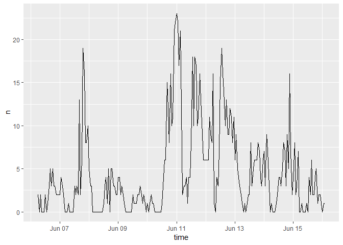
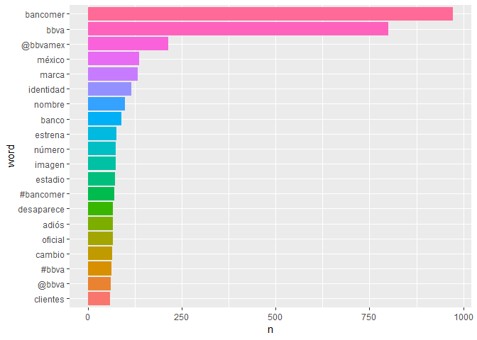
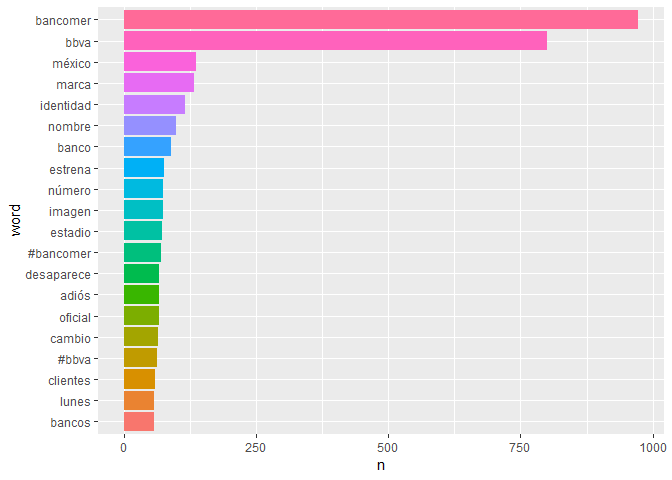
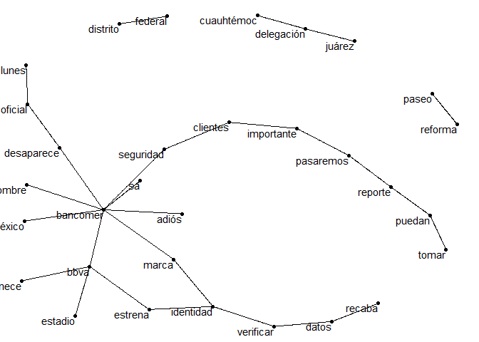
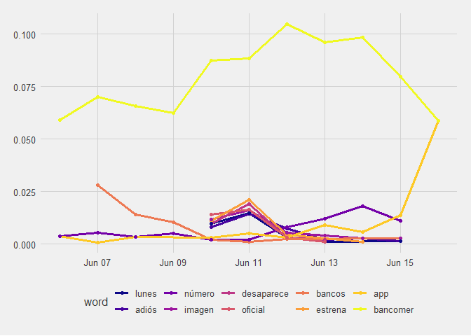

Data Mining BBVA
================
Alan
June 15, 2019

Análisis y minería de Tweets sobre BBVA Bancomer.
=================================================

Prueba de Data Mining en Twitter usando el paquete rtweet. Se tomo una muestra de 1,100 tweets los cuales tuvieran la palabra o estuvieran referenciados a Bancomer..
Para bajar los tweets se necesita una cuenta de twitter y solo se permite bajar 18,000 tweets cada 15 minutos. Al bajar los Tweets se obtiene la siguiente distribución de tweets:

``` r
ts_plot(Tweets, by = "1 hours")
```



Para analizar los tweets, se deben de quitar cosas como emojis, URL, tweets de noticias asi como palabras comunes (ej. asi, de, a, etc.). Después se tienen que separar los tweets en palabras individuales lo cuales se logran con el paquete tidytext. Las 20 palabras mas usadas son:



Eliminando todas las palabras que empiezen con @ tenemos lo siguiente:



Lo que más resalta es que al momento de estos tweets, se realizó el cambio de nombre de BBVA, por lo se observan palabras como identidad, marca, etc.

Otra forma de analizar texto es usando n-grams, este caso juntando 2 palabras y contando cuando estas 2 palabra ocurren.

``` r
 dat_bigram <- tidy_tweets %>%  group_by(tweet_number) %>%  summarise(text = str_c(word, collapse = " "))%>% 
   unnest_tokens(bigram, text, token = "ngrams", n = 2, collapse = FALSE)%>% 
   na.omit() %>% filter(!bigram %in% c("u fe0f", "bancomer u"))
 dat_bigram %>%
   count(bigram, sort = TRUE)%>%
   head(20)%>%
   kable(align = "c") 
```

|        bigram        |  n  |
|:--------------------:|:---:|
|     bbva bancomer    | 442 |
|     bancomer bbva    |  94 |
|     bbva estrena     |  74 |
|    marca bancomer    |  69 |
|     estadio bbva     |  64 |
|  bancomer desaparece |  59 |
|    identidad marca   |  55 |
|    adiós bancomer    |  53 |
|  desaparece oficial  |  52 |
|   estrena identidad  |  47 |
|    pertenece bbva    |  46 |
|     oficial lunes    |  44 |
|  seguridad clientes  |  37 |
|  clientes importante |  34 |
|  bancomer seguridad  |  32 |
| importante pasaremos |  32 |
|     paseo reforma    |  32 |
|    datos verificar   |  30 |
|   pasaremos reporte  |  30 |
|     recaba datos     |  30 |

Se nota el cambio de identidad en los pares de palabras. Una forma de ver la relación entre las palabras es usando una gráfica de redes lo cual nos da lo siguiente:



Ahora veremos que palabras cambian rápidamente en el periodo de los tweets. O para decirlo de otra manera, ¿Que palabras se usan más o menos a lo largo del día? Para realizar esto, tenemos que definir contenedores de un día y contar el número de palabras usadas dentro de esos contenedores y solo se usaran palabras que sean usadas un mínimo de 30 veces.

    ## # A tibble: 337 x 5
    ##    time_floor          word        count time_total word_total
    ##    <dttm>              <chr>       <int>      <int>      <int>
    ##  1 2019-06-06 00:00:00 #bbva           1        526         62
    ##  2 2019-06-06 00:00:00 app             2        526         54
    ##  3 2019-06-06 00:00:00 banco           4        526         90
    ##  4 2019-06-06 00:00:00 bancomer       31        526        973
    ##  5 2019-06-06 00:00:00 bbva           31        526        801
    ##  6 2019-06-06 00:00:00 clientes        9        526         59
    ##  7 2019-06-06 00:00:00 confirmamos     3        526         31
    ##  8 2019-06-06 00:00:00 cuauhtémoc      5        526         43
    ##  9 2019-06-06 00:00:00 datos           5        526         54
    ## 10 2019-06-06 00:00:00 estadio         5        526         72
    ## # ... with 327 more rows

La columna count nos indica las veces que se usó esa palabra en el contenedor de una hora, time\_total nos dice cuantas palabras se usaron en ese periodo de tiempo y word\_total indica cuantas veces se usó esa palabra en tod el periodo.

Tenemos que realizar un modelo general lineal para cada palabra. Estos modelos responden la pregunta ¿Fue esta palabra mencionada en algún contenedor? ¿Si o No? ¿Como el número de menciones de una palabra depende con el tiempo? Para realizar esto, para cada palabra se adjuntan los datos de cada contenedor y se adjunta el modelo generado.

    ## # A tibble: 39 x 3
    ##    word        data              models   
    ##    <chr>       <list>            <list>   
    ##  1 #bbva       <tibble [9 x 4]>  <S3: glm>
    ##  2 app         <tibble [10 x 4]> <S3: glm>
    ##  3 banco       <tibble [11 x 4]> <S3: glm>
    ##  4 bancomer    <tibble [11 x 4]> <S3: glm>
    ##  5 bbva        <tibble [10 x 4]> <S3: glm>
    ##  6 clientes    <tibble [10 x 4]> <S3: glm>
    ##  7 confirmamos <tibble [9 x 4]>  <S3: glm>
    ##  8 cuauhtémoc  <tibble [10 x 4]> <S3: glm>
    ##  9 datos       <tibble [10 x 4]> <S3: glm>
    ## 10 estadio     <tibble [10 x 4]> <S3: glm>
    ## # ... with 29 more rows

El resultado contiene la palabra, la columna data contiene los datos con los contenedores y la columna models contiene el modelo que corresponde a cada palabra.

Posteriormente extraemos las pendientes de cada modelo y buscamos las más importantes. Estamos comparando muchas pendientes por lo cual se aplica un ajuste a los valores p para realizar comparaciones múltiples, y se filtra para encontrar las pendientes más significativas.

    ## # A tibble: 10 x 7
    ##    word    term      estimate std.error statistic  p.value adjusted.p.value
    ##    <chr>   <chr>        <dbl>     <dbl>     <dbl>    <dbl>            <dbl>
    ##  1 app     time_f~    2.76e-6   7.50e-7      3.69 2.29e- 4  0.00731        
    ##  2 bancom~ time_f~    5.47e-7   1.62e-7      3.38 7.22e- 4  0.0217         
    ##  3 número  time_f~    2.58e-6   6.29e-7      4.10 4.07e- 5  0.00147        
    ##  4 bancos  time_f~   -6.44e-6   8.89e-7     -7.24 4.43e-13  0.0000000000173
    ##  5 adiós   time_f~   -4.25e-6   1.14e-6     -3.72 1.99e- 4  0.00658        
    ##  6 desapa~ time_f~   -5.80e-6   1.61e-6     -3.61 3.11e- 4  0.00964        
    ##  7 estrena time_f~   -5.66e-6   1.39e-6     -4.06 4.90e- 5  0.00172        
    ##  8 imagen  time_f~   -4.61e-6   1.10e-6     -4.18 2.94e- 5  0.00109        
    ##  9 lunes   time_f~   -6.20e-6   1.56e-6     -3.99 6.67e- 5  0.00227        
    ## 10 oficial time_f~   -7.68e-6   1.70e-6     -4.52 6.08e- 6  0.000231

Tenemos que visualizar los resultados por lo que graficamos a lo largo del periodo y obtenemos la siguiente grafica.



Podemos observar que la palabra mas usada y la que mas cambia a lo largo del tiempo es Bancomer. La
palabra que mas salta, especificamente al final es estrena.
<br />
Interesantemente BBVA no aparece.