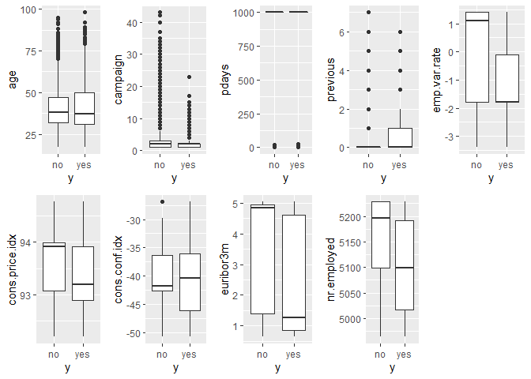
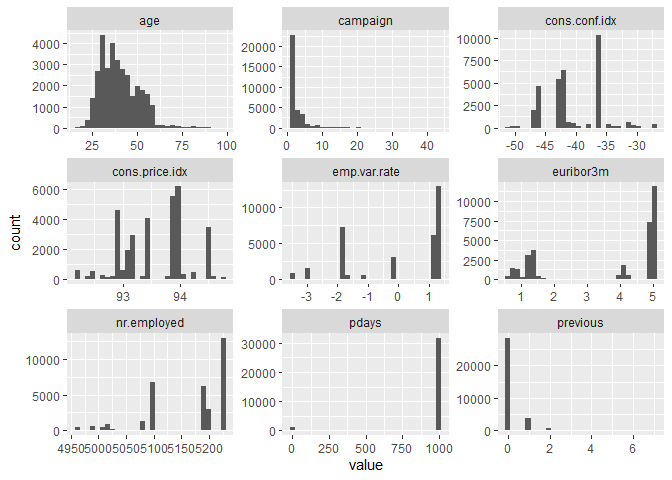
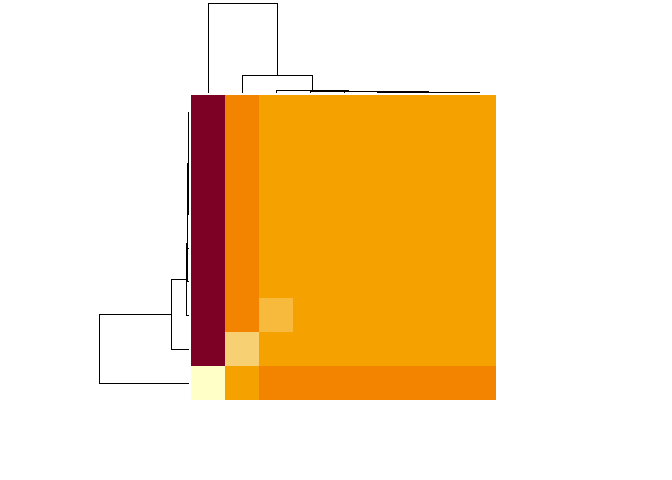
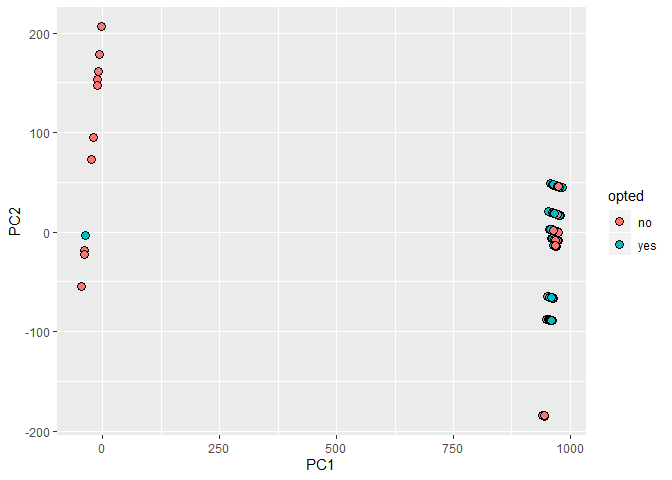
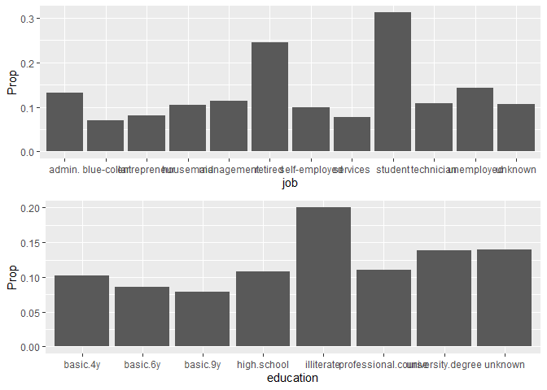
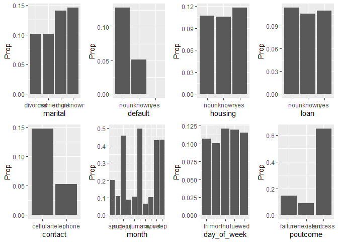
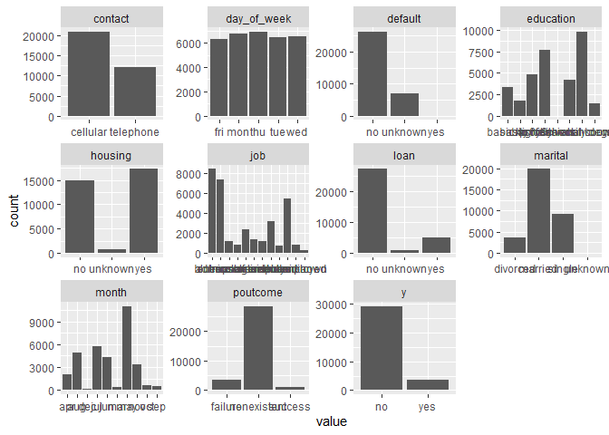

Bank Telemarketing
================
Alan Tovar
September 6, 2019

Overview
--------

We are going to use the Bank marketing data set from S. Moro, P. Cortez and P. Rita. A Data-Driven Approach to Predict the Success of Bank Telemarketing. Decision Support Systems, Elsevier, 62:22-31, June 2014. This data set comes from the UCI machine Learning repository, the full set consist of 41,188 observations and 21 variables consisting in bank client data (age, job, education, marital, default, housing, loan), related to the last contact from current campaign (contact, month, day of week, duration), other attributes (campaign, pdays, previous, poutcome), social and economic context attributes (emp. var. rate, cons. conf. idx, euribor3m, nr.employed) and the dependent variable if the client subscribed a term deposit. The data set will be divided into train set and test where we will predict if the the client subscribed a term deposit or not, we removed the duration variable as it is used only for benchmark purposes as it was added at the end of the campaign. We explored the data, and tried different methods including one hot encoding that resulted in a balance score and Specificity of - and - respectively on the test set.

### Data Exploration

First we split the data into a train and a test set. We are going to divide 20% to be the test set. We get the following structure for the train set.

``` r
str(train_set)
```

    ## 'data.frame':    32950 obs. of  20 variables:
    ##  $ age           : int  56 57 37 56 45 41 24 41 57 35 ...
    ##  $ job           : Factor w/ 12 levels "admin.","blue-collar",..: 4 8 8 8 8 2 10 2 4 2 ...
    ##  $ marital       : Factor w/ 4 levels "divorced","married",..: 2 2 2 2 2 2 3 2 1 2 ...
    ##  $ education     : Factor w/ 8 levels "basic.4y","basic.6y",..: 1 4 4 4 3 8 6 8 1 2 ...
    ##  $ default       : Factor w/ 3 levels "no","unknown",..: 1 2 1 1 2 2 1 2 1 1 ...
    ##  $ housing       : Factor w/ 3 levels "no","unknown",..: 1 1 3 1 1 1 3 1 3 3 ...
    ##  $ loan          : Factor w/ 3 levels "no","unknown",..: 1 1 1 3 1 1 1 1 1 1 ...
    ##  $ contact       : Factor w/ 2 levels "cellular","telephone": 2 2 2 2 2 2 2 2 2 2 ...
    ##  $ month         : Factor w/ 10 levels "apr","aug","dec",..: 7 7 7 7 7 7 7 7 7 7 ...
    ##  $ day_of_week   : Factor w/ 5 levels "fri","mon","thu",..: 2 2 2 2 2 2 2 2 2 2 ...
    ##  $ campaign      : int  1 1 1 1 1 1 1 1 1 1 ...
    ##  $ pdays         : int  999 999 999 999 999 999 999 999 999 999 ...
    ##  $ previous      : int  0 0 0 0 0 0 0 0 0 0 ...
    ##  $ poutcome      : Factor w/ 3 levels "failure","nonexistent",..: 2 2 2 2 2 2 2 2 2 2 ...
    ##  $ emp.var.rate  : num  1.1 1.1 1.1 1.1 1.1 1.1 1.1 1.1 1.1 1.1 ...
    ##  $ cons.price.idx: num  94 94 94 94 94 ...
    ##  $ cons.conf.idx : num  -36.4 -36.4 -36.4 -36.4 -36.4 -36.4 -36.4 -36.4 -36.4 -36.4 ...
    ##  $ euribor3m     : num  4.86 4.86 4.86 4.86 4.86 ...
    ##  $ nr.employed   : num  5191 5191 5191 5191 5191 ...
    ##  $ y             : Factor w/ 2 levels "no","yes": 1 1 1 1 1 1 1 1 1 1 ...

We have 10 variables that are factors (excluding y), and 9 numeric columns. We are going to analyze the continuous variables and the factors separately and then we incorporate what we found to the models.

#### Continuous Variables

We will plot the relationship between the variables and the dependent variables.



For yes and no we see overlapping on all variables, but in some variables we see a higher mean for the no variable. We do not find a variable that is strongly predictive on the dependent variable.

Next we need to see the distribution of the variables.

``` r
train_set %>% keep(is.numeric) %>%  gather() %>% 
  ggplot(aes(value)) +
  facet_wrap(~ key, scales = "free") +
  geom_histogram()
```



The variables do not follow a normal distribution nor any other distribution, in fact except age the other variables are sparse regarding values. There could be variables that are similar to each other so we are going to calculate the distance between them and see if there are distinct variables.

``` r
cont <- train_set %>% keep(is.numeric) %>% names()
conset <- train_set[cont]
d <- dist(t(as.matrix(conset)))
heatmap(as.matrix(d), labRow = NA, labCol = NA)
```



We clearly see similar variables and 2 different variables those are:

    ## $`1`
    ## [1] "age"            "campaign"       "previous"       "emp.var.rate"  
    ## [5] "cons.price.idx" "cons.conf.idx"  "euribor3m"     
    ## 
    ## $`2`
    ## [1] "pdays"
    ## 
    ## $`3`
    ## [1] "nr.employed"

Finally we are going to perform PCA to see if we can find some interesting when using 2 components. 

We find two like clusters, one has only one yes point while the other cluster has the rest of the data, however it does not help us to divide the decision of the user. At the end, we are going to use pdays and nr. employed in our model as there are the ones that seems unique. We are going to focus on the discrete variables.

#### Discrete Variables

We are going to take the proportion of yes vs total and plot it against each discrete variable to see the ones that give the most yes.





We find that there are variables with higher proportion on the factors such as poutcome meaning if the client accepted a previous campaign then is more likely to accept again. We find that job, education, month and poutcome are the ones with higher proportion of yes.

We are going to count how many times each factor appears, to understand more about the data.

``` r
train_set %>% keep(is.factor) %>%  gather() %>% 
  ggplot(aes(value)) +
  facet_wrap(~ key, scales = "free") +
  geom_histogram(stat="count")
```

    ## Warning: attributes are not identical across measure variables;
    ## they will be dropped

    ## Warning: Ignoring unknown parameters: binwidth, bins, pad



The most important thing is regarding the depended variable, the cases of yes are minimal compare to the no case. This will make predicting yes difficult as you have an insignificant amount, so as a recommendation this data set needs more data to improve the predictions.

After looking at the data we will divide the train set into train and valid set in order to find the best model.

    ## [1] "strain_set" "test_set"   "train_set"  "valid_set"

we have the strain and valid for model creation.

### Models

Our base model will be a lineal model made of 6 variables that we identified previously.

``` r
gl_model <- train(y ~ job + education + month + poutcome + pdays + nr.employed, data = strain_set, method = "glm")
preds <- predict(gl_model, valid_set)
```

    ## Warning: `data_frame()` is deprecated, use `tibble()`.
    ## This warning is displayed once per session.

| method |    Acc|     F1|  Balance|  Specificity|
|:-------|------:|------:|--------:|------------:|
| GLM    |  0.891|  0.941|    0.727|        0.548|

We look a 4 metrics, because no is more prevalent is easier to predict that variable therefore the accuracy will be high, but as a bank we are more interested in those who say yes. Balance and specificity will help us in this regard. Our data does not follow a distribution nor a lineal relation, so a random forest model will be more useful.

``` r
rf <- randomForest(y ~ job + education + month + poutcome + pdays + nr.employed,
                   data = strain_set, sampsize=5000, importance=TRUE)
preds <- predict(rf, valid_set)
```

| method |    Acc|     F1|  Balance|  Specificity|
|:-------|------:|------:|--------:|------------:|
| GLM    |  0.891|  0.941|    0.727|        0.548|
| RF     |  0.894|  0.943|    0.745|        0.583|

We see an improvement using random forest instead of lineal model. In order to improve more we will use a feature of random forest called variable importance, for this we will fit a random forest to all the variables.

| method      |    Acc|     F1|  Balance|  Specificity|
|:------------|------:|------:|--------:|------------:|
| GLM         |  0.891|  0.941|    0.727|        0.548|
| RF          |  0.894|  0.943|    0.745|        0.583|
| RF All data |  0.893|  0.942|    0.737|        0.564|

We see it is worse than the previous forest, but we care about the variables.

``` r
imp <- varImp(rf)
imp
```

    ##                     no     yes
    ## age            14.8570 14.8570
    ## job            14.7005 14.7005
    ## marital         4.5679  4.5679
    ## education       8.5588  8.5588
    ## default         3.9581  3.9581
    ## housing        -1.9469 -1.9469
    ## loan            0.0336  0.0336
    ## contact        13.7778 13.7778
    ## month           6.2232  6.2232
    ## day_of_week    12.6234 12.6234
    ## campaign        7.6479  7.6479
    ## pdays          17.9813 17.9813
    ## previous        5.3460  5.3460
    ## poutcome       12.7739 12.7739
    ## emp.var.rate    8.4737  8.4737
    ## cons.price.idx  1.1063  1.1063
    ## cons.conf.idx   3.1808  3.1808
    ## euribor3m      13.9479 13.9479
    ## nr.employed    16.3978 16.3978

There are 8 variables above 10, so we are going to use those for the predictions. Some of them we had already used them in the previous method.

| method      |    Acc|     F1|  Balance|  Specificity|
|:------------|------:|------:|--------:|------------:|
| GLM         |  0.891|  0.941|    0.727|        0.548|
| RF          |  0.894|  0.943|    0.745|        0.583|
| RF All data |  0.893|  0.942|    0.737|        0.564|
| RF imp      |  0.894|  0.943|    0.744|        0.582|

We do not see any improvement from the first Random Forest. To better improve our model, we are going to use one hot encoding. For one hot encoding we are going to take the categorical variables (e.g. contact) and convert each factor to a variable with 0 meaning it does not have that value and 1 it does have that value. So our data becomes like this:

``` r
impset <- dummy_cols(impset, select_columns = c("job","contact","day_of_week", "poutcome"))
str(impset)
```

    ## 'data.frame':    28007 obs. of  31 variables:
    ##  $ y                   : Factor w/ 2 levels "no","yes": 1 1 1 1 1 1 1 1 1 1 ...
    ##  $ age                 : int  56 57 37 56 45 24 41 57 35 54 ...
    ##  $ job                 : Factor w/ 12 levels "admin.","blue-collar",..: 4 8 8 8 8 10 2 4 2 6 ...
    ##  $ contact             : Factor w/ 2 levels "cellular","telephone": 2 2 2 2 2 2 2 2 2 2 ...
    ##  $ day_of_week         : Factor w/ 5 levels "fri","mon","thu",..: 2 2 2 2 2 2 2 2 2 2 ...
    ##  $ pdays               : int  999 999 999 999 999 999 999 999 999 999 ...
    ##  $ poutcome            : Factor w/ 3 levels "failure","nonexistent",..: 2 2 2 2 2 2 2 2 2 2 ...
    ##  $ euribor3m           : num  4.86 4.86 4.86 4.86 4.86 ...
    ##  $ nr.employed         : num  5191 5191 5191 5191 5191 ...
    ##  $ job_admin.          : int  0 0 0 0 0 0 0 0 0 0 ...
    ##  $ job_blue-collar     : int  0 0 0 0 0 0 1 0 1 0 ...
    ##  $ job_entrepreneur    : int  0 0 0 0 0 0 0 0 0 0 ...
    ##  $ job_housemaid       : int  1 0 0 0 0 0 0 1 0 0 ...
    ##  $ job_management      : int  0 0 0 0 0 0 0 0 0 0 ...
    ##  $ job_retired         : int  0 0 0 0 0 0 0 0 0 1 ...
    ##  $ job_self-employed   : int  0 0 0 0 0 0 0 0 0 0 ...
    ##  $ job_services        : int  0 1 1 1 1 0 0 0 0 0 ...
    ##  $ job_student         : int  0 0 0 0 0 0 0 0 0 0 ...
    ##  $ job_technician      : int  0 0 0 0 0 1 0 0 0 0 ...
    ##  $ job_unemployed      : int  0 0 0 0 0 0 0 0 0 0 ...
    ##  $ job_unknown         : int  0 0 0 0 0 0 0 0 0 0 ...
    ##  $ contact_cellular    : int  0 0 0 0 0 0 0 0 0 0 ...
    ##  $ contact_telephone   : int  1 1 1 1 1 1 1 1 1 1 ...
    ##  $ day_of_week_fri     : int  0 0 0 0 0 0 0 0 0 0 ...
    ##  $ day_of_week_mon     : int  1 1 1 1 1 1 1 1 1 1 ...
    ##  $ day_of_week_thu     : int  0 0 0 0 0 0 0 0 0 0 ...
    ##  $ day_of_week_tue     : int  0 0 0 0 0 0 0 0 0 0 ...
    ##  $ day_of_week_wed     : int  0 0 0 0 0 0 0 0 0 0 ...
    ##  $ poutcome_failure    : int  0 0 0 0 0 0 0 0 0 0 ...
    ##  $ poutcome_nonexistent: int  1 1 1 1 1 1 1 1 1 1 ...
    ##  $ poutcome_success    : int  0 0 0 0 0 0 0 0 0 0 ...

After one hot encoding, we remove all the factors and create a new model with this data. Our result is the following:

| method      |    Acc|     F1|  Balance|  Specificity|
|:------------|------:|------:|--------:|------------:|
| GLM         |  0.891|  0.941|    0.727|        0.548|
| RF          |  0.894|  0.943|    0.745|        0.583|
| RF All data |  0.893|  0.942|    0.737|        0.564|
| RF imp      |  0.894|  0.943|    0.744|        0.582|
| RF One hot  |  0.896|  0.944|    0.759|        0.609|

We see a greater improvement, our specificity is around 0.6 so we are improving our predictions for clients that say yes. We are going to use this model for our test set as we didn't find other improvements as our data lacks more information for "yes", so it has a limit of how much it can predict with the information that we have.

Results and Conclusion
----------------------

Using the one hot encoding model with the important variables on our full train data to predict our test data we found the following result.

| method       |    Acc|     F1|  Balance|  Specificity|
|:-------------|------:|------:|--------:|------------:|
| Final result |  0.902|  0.947|    0.806|        0.703|

From our last model with "partial data" to using all the data we found a huge improvement from .609 to 0.703 regarding specificity, and balance improved to 0.8. This model is fairly good, however it stills fails to better predict "yes", this is as we discussed earlier because the number of "yes" against "no" is low. Using one hot encoding was key to reach this score and we will find other sets where we can use it. For the next steps we will explore other models like neural networks or boosted trees to see if they can capture better the characteristics that will lead to a "yes".

Data source: S. Moro, P. Cortez and P. Rita. A Data-Driven Approach to Predict the Success of Bank Telemarketing. Decision Support Systems, Elsevier, 62:22-31, June 2014.
