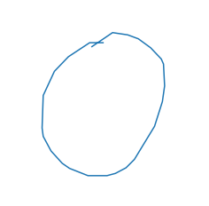

Determinando Culturas a través de Dibujos
================
Alan Tovar 
September 6, 2020 
 

Dibuja un círculo, ya sea con la mano o en la mente, pero dibuja uno. ¿Listo? 
¿Hacia qué lado empezaste? ¿Sentido de las manecillas del reloj o en contra? 
  
Si eres de América o Europa, lo mas probable es que fuera en contra las manecillas del reloj. Mientras en Japón lo mas seguro es que fuera en sentido de las manecillas. 
¿Como podemos saber esto? En noviembre del 2016, Google lanzo Quick, Draw!. Quick, Draw! Es un juego el cual te pide dibujar una palabra en un tiempo determinado y una Inteligencia Artificial trata de adivinar. Se puede jugar [aquí]( https://quickdraw.withgoogle.com/).
 

Google lanzó al público más de 50 millones de dibujos, hechos por distintas personas que han jugado Quick Draw. Gracias a este set de imágenes podemos conocer como la gente dibuja, y encontrar distintas relaciones. Un ejemplo de esto son las imágenes de círculos.
Gracias a [geometria]( https://www.element84.com/blog/determining-the-winding-of-a-polygon-given-as-a-set-of-ordered-points ) podemos saber que direccion se uso para dibujar el circulo.

