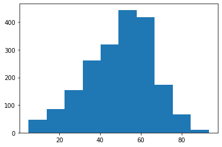

# GeoVisualization using Keplergl & Uber's Movement data

We are going to use Uber's Keplergl and movement data to visualize Mexico times. 
KeplerGl is uber's open source and default program for geovisualization. They developed a jupyter widget, so we are going to see how it works.
We will use Uber's Movement data. This dataset contains the average daily ride times for the month of june 19 an 17 for the city of Mexico that is available at https://movement.uber.com


```python
%load_ext autoreload
%autoreload 2
%matplotlib inline
```


```python
from keplergl import KeplerGl
import pandas as pd
import geopandas
import matplotlib.pyplot as plt
```


```python
junetimes = pd.read_csv(f'{PATH}Travel_Timesjune.csv')
june17 = pd.read_csv(f'{PATH}Travel_Timesjune17.csv')
agents = geopandas.read_file(f'{PATH}mexico_city_agebs.json')
```


```python
junetimes.shape
```


    (2099, 8)


```python
june17.shape
```


    (2154, 8)


```python
junetimes.head()
```


<div>
<style scoped>
    .dataframe tbody tr th:only-of-type {
        vertical-align: middle;
    }

    .dataframe tbody tr th {
        vertical-align: top;
    }

    .dataframe thead th {
        text-align: right;
    }
</style>
<table border="1" class="dataframe">
  <thead>
    <tr style="text-align: right;">
      <th></th>
      <th>Origin Movement ID</th>
      <th>Origin Display Name</th>
      <th>Destination Movement ID</th>
      <th>Destination Display Name</th>
      <th>Date Range</th>
      <th>Mean Travel Time (Seconds)</th>
      <th>Range - Lower Bound Travel Time (Seconds)</th>
      <th>Range - Upper Bound Travel Time (Seconds)</th>
    </tr>
  </thead>
  <tbody>
    <tr>
      <td>0</td>
      <td>2922</td>
      <td>Movement Zone 2922</td>
      <td>9</td>
      <td>Movement Zone 9</td>
      <td>6/1/2019 - 6/30/2019, Weekdays, Daily Average</td>
      <td>2164</td>
      <td>1666</td>
      <td>2809</td>
    </tr>
    <tr>
      <td>1</td>
      <td>2922</td>
      <td>Movement Zone 2922</td>
      <td>10</td>
      <td>Movement Zone 10</td>
      <td>6/1/2019 - 6/30/2019, Weekdays, Daily Average</td>
      <td>1283</td>
      <td>988</td>
      <td>1665</td>
    </tr>
    <tr>
      <td>2</td>
      <td>2922</td>
      <td>Movement Zone 2922</td>
      <td>11</td>
      <td>Movement Zone 11</td>
      <td>6/1/2019 - 6/30/2019, Weekdays, Daily Average</td>
      <td>1465</td>
      <td>1080</td>
      <td>1986</td>
    </tr>
    <tr>
      <td>3</td>
      <td>2922</td>
      <td>Movement Zone 2922</td>
      <td>15</td>
      <td>Movement Zone 15</td>
      <td>6/1/2019 - 6/30/2019, Weekdays, Daily Average</td>
      <td>1633</td>
      <td>1194</td>
      <td>2232</td>
    </tr>
    <tr>
      <td>4</td>
      <td>2922</td>
      <td>Movement Zone 2922</td>
      <td>16</td>
      <td>Movement Zone 16</td>
      <td>6/1/2019 - 6/30/2019, Weekdays, Daily Average</td>
      <td>1480</td>
      <td>1049</td>
      <td>2086</td>
    </tr>
  </tbody>
</table>
</div>


```python
junetimes.describe()
```


<div>
<style scoped>
    .dataframe tbody tr th:only-of-type {
        vertical-align: middle;
    }

    .dataframe tbody tr th {
        vertical-align: top;
    }

    .dataframe thead th {
        text-align: right;
    }
</style>
<table border="1" class="dataframe">
  <thead>
    <tr style="text-align: right;">
      <th></th>
      <th>Origin Movement ID</th>
      <th>Destination Movement ID</th>
      <th>Mean Travel Time (Seconds)</th>
      <th>Range - Lower Bound Travel Time (Seconds)</th>
      <th>Range - Upper Bound Travel Time (Seconds)</th>
    </tr>
  </thead>
  <tbody>
    <tr>
      <td>count</td>
      <td>2099.0</td>
      <td>2099.000000</td>
      <td>2099.000000</td>
      <td>2099.000000</td>
      <td>2099.000000</td>
    </tr>
    <tr>
      <td>mean</td>
      <td>2922.0</td>
      <td>3265.676989</td>
      <td>2644.540257</td>
      <td>1877.721772</td>
      <td>3746.479752</td>
    </tr>
    <tr>
      <td>std</td>
      <td>0.0</td>
      <td>1348.543174</td>
      <td>938.813955</td>
      <td>683.300357</td>
      <td>1373.550719</td>
    </tr>
    <tr>
      <td>min</td>
      <td>2922.0</td>
      <td>9.000000</td>
      <td>232.000000</td>
      <td>49.000000</td>
      <td>596.000000</td>
    </tr>
    <tr>
      <td>25%</td>
      <td>2922.0</td>
      <td>2479.000000</td>
      <td>1946.500000</td>
      <td>1402.000000</td>
      <td>2684.000000</td>
    </tr>
    <tr>
      <td>50%</td>
      <td>2922.0</td>
      <td>3430.000000</td>
      <td>2703.000000</td>
      <td>1926.000000</td>
      <td>3805.000000</td>
    </tr>
    <tr>
      <td>75%</td>
      <td>2922.0</td>
      <td>4404.500000</td>
      <td>3343.500000</td>
      <td>2360.500000</td>
      <td>4721.000000</td>
    </tr>
    <tr>
      <td>max</td>
      <td>2922.0</td>
      <td>5084.000000</td>
      <td>5245.000000</td>
      <td>3776.000000</td>
      <td>9456.000000</td>
    </tr>
  </tbody>
</table>
</div>


```python
june17.drop(['Origin Movement ID','Origin Display Name','Date Range','Destination Display Name'], axis=1,inplace=True)
```


```python
june17.rename(columns = {'Mean Travel Time (Seconds)':'Travel Time 17',
                        'Range - Lower Bound Travel Time (Seconds)':'Range Lower 17',
                        'Range - Upper Bound Travel Time (Seconds)':'Range Upper 17'}, inplace = True) 
```


```python
data = junetimes.merge(june17, on='Destination Movement ID' )
```


```python
data.head()
```


<div>
<style scoped>
    .dataframe tbody tr th:only-of-type {
        vertical-align: middle;
    }

    .dataframe tbody tr th {
        vertical-align: top;
    }

    .dataframe thead th {
        text-align: right;
    }
</style>
<table border="1" class="dataframe">
  <thead>
    <tr style="text-align: right;">
      <th></th>
      <th>Origin Movement ID</th>
      <th>Origin Display Name</th>
      <th>Destination Movement ID</th>
      <th>Destination Display Name</th>
      <th>Date Range</th>
      <th>Mean Travel Time (Seconds)</th>
      <th>Range - Lower Bound Travel Time (Seconds)</th>
      <th>Range - Upper Bound Travel Time (Seconds)</th>
      <th>Travel Time 17</th>
      <th>Range Lower 17</th>
      <th>Range Upper 17</th>
    </tr>
  </thead>
  <tbody>
    <tr>
      <td>0</td>
      <td>2922</td>
      <td>Movement Zone 2922</td>
      <td>9</td>
      <td>Movement Zone 9</td>
      <td>6/1/2019 - 6/30/2019, Weekdays, Daily Average</td>
      <td>2164</td>
      <td>1666</td>
      <td>2809</td>
      <td>1989</td>
      <td>1481</td>
      <td>2669</td>
    </tr>
    <tr>
      <td>1</td>
      <td>2922</td>
      <td>Movement Zone 2922</td>
      <td>10</td>
      <td>Movement Zone 10</td>
      <td>6/1/2019 - 6/30/2019, Weekdays, Daily Average</td>
      <td>1283</td>
      <td>988</td>
      <td>1665</td>
      <td>1583</td>
      <td>1158</td>
      <td>2162</td>
    </tr>
    <tr>
      <td>2</td>
      <td>2922</td>
      <td>Movement Zone 2922</td>
      <td>11</td>
      <td>Movement Zone 11</td>
      <td>6/1/2019 - 6/30/2019, Weekdays, Daily Average</td>
      <td>1465</td>
      <td>1080</td>
      <td>1986</td>
      <td>1478</td>
      <td>1056</td>
      <td>2066</td>
    </tr>
    <tr>
      <td>3</td>
      <td>2922</td>
      <td>Movement Zone 2922</td>
      <td>15</td>
      <td>Movement Zone 15</td>
      <td>6/1/2019 - 6/30/2019, Weekdays, Daily Average</td>
      <td>1633</td>
      <td>1194</td>
      <td>2232</td>
      <td>1831</td>
      <td>1305</td>
      <td>2567</td>
    </tr>
    <tr>
      <td>4</td>
      <td>2922</td>
      <td>Movement Zone 2922</td>
      <td>16</td>
      <td>Movement Zone 16</td>
      <td>6/1/2019 - 6/30/2019, Weekdays, Daily Average</td>
      <td>1480</td>
      <td>1049</td>
      <td>2086</td>
      <td>1660</td>
      <td>1125</td>
      <td>2447</td>
    </tr>
  </tbody>
</table>
</div>


```python
data.rename(columns = {'Destination Display Name':'DISPLAY_NAME',
                      'Mean Travel Time (Seconds)':'Travel Time 19',
                        'Range - Lower Bound Travel Time (Seconds)':'Range Lower 19',
                        'Range - Upper Bound Travel Time (Seconds)':'Range Upper 19'}, inplace = True) 
```


```python
data['Travel Time 19'] = data['Travel Time 19']/60
```


```python
data['Travel Time 17'] = data['Travel Time 17']/60
```


```python
data['Change'] = data['Travel Time 19'] - data['Travel Time 17']
```


```python
fig = plt.figure()
ax = fig.add_subplot(111)
timedf = data['Travel Time 19'].values
ax.hist(timedf)
```


    (array([ 52., 108., 227., 300., 351., 376., 355., 151.,  56.,   5.]),
     array([ 3.86666667, 12.22166667, 20.57666667, 28.93166667, 37.28666667,
            45.64166667, 53.99666667, 62.35166667, 70.70666667, 79.06166667,
            87.41666667]),
     <a list of 10 Patch objects>)


```python
fig = plt.figure()
ax = fig.add_subplot(111)
timedf = data['Travel Time 17'].values
ax.hist(timedf)
```


    (array([ 47.,  86., 154., 261., 320., 444., 418., 174.,  67.,  10.]),
     array([ 4.81666667, 13.675     , 22.53333333, 31.39166667, 40.25      ,
            49.10833333, 57.96666667, 66.825     , 75.68333333, 84.54166667,
            93.4       ]),
     <a list of 10 Patch objects>)





```python
agents.head()
```


<div>
<style scoped>
    .dataframe tbody tr th:only-of-type {
        vertical-align: middle;
    }

    .dataframe tbody tr th {
        vertical-align: top;
    }

    .dataframe thead th {
        text-align: right;
    }
</style>
<table border="1" class="dataframe">
  <thead>
    <tr style="text-align: right;">
      <th></th>
      <th>CVE_AGEB</th>
      <th>CVE_MUN</th>
      <th>CVE_LOC</th>
      <th>CVE_ENT</th>
      <th>MOVEMENT_ID</th>
      <th>DISPLAY_NAME</th>
      <th>geometry</th>
    </tr>
  </thead>
  <tbody>
    <tr>
      <td>0</td>
      <td>1142</td>
      <td>121</td>
      <td>0</td>
      <td>15</td>
      <td>1</td>
      <td>Movement Zone 1</td>
      <td>POLYGON ((-99.24182 19.68300, -99.24096 19.681...</td>
    </tr>
    <tr>
      <td>1</td>
      <td>1012</td>
      <td>122</td>
      <td>0</td>
      <td>15</td>
      <td>2</td>
      <td>Movement Zone 2</td>
      <td>POLYGON ((-98.96833 19.29859, -98.96824 19.299...</td>
    </tr>
    <tr>
      <td>2</td>
      <td>0393</td>
      <td>002</td>
      <td>0</td>
      <td>15</td>
      <td>3</td>
      <td>Movement Zone 3</td>
      <td>POLYGON ((-98.91891 19.68579, -98.91798 19.685...</td>
    </tr>
    <tr>
      <td>3</td>
      <td>003A</td>
      <td>046</td>
      <td>0</td>
      <td>15</td>
      <td>4</td>
      <td>Movement Zone 4</td>
      <td>POLYGON ((-99.34220 19.55510, -99.34167 19.554...</td>
    </tr>
    <tr>
      <td>4</td>
      <td>0037</td>
      <td>089</td>
      <td>0</td>
      <td>15</td>
      <td>5</td>
      <td>Movement Zone 5</td>
      <td>POLYGON ((-98.87485 19.18100, -98.87470 19.180...</td>
    </tr>
  </tbody>
</table>
</div>


```python
df = agents.merge(data, on='DISPLAY_NAME' )
```


```python
map1 = KeplerGl(height=850)
```

    User Guide: https://github.com/keplergl/kepler.gl/blob/master/docs/keplergl-jupyter/user-guide.md
    


```python
map1.add_data(data=df, name='d')
```


```python
map1
```


```python

```
