<h1>
    Predicting House Prices
    </h1>
    

The House prices dataset is from Kaggle.
A combination of random forest and a Neural Net


```python
%load_ext autoreload
%autoreload 2
%matplotlib inline
```


```python
from fastai.imports import *
from fastai.tabular import * 
from fastai.callbacks import *
from sklearn import metrics
from sklearn.ensemble import RandomForestRegressor
from scipy.stats import norm, skew
from scipy.special import boxcox1p
from scipy.stats import boxcox
import seaborn as sns
```


```python
PATH = 'C:/Users/Alan/.fastai/data/houses/'
PATH
```


    'C:/Users/Alan/.fastai/data/houses/'


```python
df_raw = pd.read_csv(f'{PATH}train.csv')
df_test = pd.read_csv(f'{PATH}test.csv')
```


```python
len(df_test)
```


    1459


```python
# for the purpose of evaluation of current competition we transform target value
df_raw.SalePrice = np.log1p(df_raw.SalePrice)
```


```python
def display_all(df):
    with pd.option_context("display.max_rows", 1000, "display.max_columns", 1000): 
        display(df)
```


```python
display_all(df_raw.head().T)
```


<div>
<style scoped>
    .dataframe tbody tr th:only-of-type {
        vertical-align: middle;
    }

    .dataframe tbody tr th {
        vertical-align: top;
    }

    .dataframe thead th {
        text-align: right;
    }
</style>
<table border="1" class="dataframe">
  <thead>
    <tr style="text-align: right;">
      <th></th>
      <th>0</th>
      <th>1</th>
      <th>2</th>
      <th>3</th>
      <th>4</th>
    </tr>
  </thead>
  <tbody>
    <tr>
      <th>Id</th>
      <td>1</td>
      <td>2</td>
      <td>3</td>
      <td>4</td>
      <td>5</td>
    </tr>
    <tr>
      <th>MSSubClass</th>
      <td>60</td>
      <td>20</td>
      <td>60</td>
      <td>70</td>
      <td>60</td>
    </tr>
    <tr>
      <th>MSZoning</th>
      <td>RL</td>
      <td>RL</td>
      <td>RL</td>
      <td>RL</td>
      <td>RL</td>
    </tr>
    <tr>
      <th>LotFrontage</th>
      <td>65</td>
      <td>80</td>
      <td>68</td>
      <td>60</td>
      <td>84</td>
    </tr>
    <tr>
      <th>LotArea</th>
      <td>8450</td>
      <td>9600</td>
      <td>11250</td>
      <td>9550</td>
      <td>14260</td>
    </tr>
    <tr>
      <th>Street</th>
      <td>Pave</td>
      <td>Pave</td>
      <td>Pave</td>
      <td>Pave</td>
      <td>Pave</td>
    </tr>
    <tr>
      <th>Alley</th>
      <td>NaN</td>
      <td>NaN</td>
      <td>NaN</td>
      <td>NaN</td>
      <td>NaN</td>
    </tr>
    <tr>
      <th>LotShape</th>
      <td>Reg</td>
      <td>Reg</td>
      <td>IR1</td>
      <td>IR1</td>
      <td>IR1</td>
    </tr>
    <tr>
      <th>LandContour</th>
      <td>Lvl</td>
      <td>Lvl</td>
      <td>Lvl</td>
      <td>Lvl</td>
      <td>Lvl</td>
    </tr>
    <tr>
      <th>Utilities</th>
      <td>AllPub</td>
      <td>AllPub</td>
      <td>AllPub</td>
      <td>AllPub</td>
      <td>AllPub</td>
    </tr>
    <tr>
      <th>LotConfig</th>
      <td>Inside</td>
      <td>FR2</td>
      <td>Inside</td>
      <td>Corner</td>
      <td>FR2</td>
    </tr>
    <tr>
      <th>LandSlope</th>
      <td>Gtl</td>
      <td>Gtl</td>
      <td>Gtl</td>
      <td>Gtl</td>
      <td>Gtl</td>
    </tr>
    <tr>
      <th>Neighborhood</th>
      <td>CollgCr</td>
      <td>Veenker</td>
      <td>CollgCr</td>
      <td>Crawfor</td>
      <td>NoRidge</td>
    </tr>
    <tr>
      <th>Condition1</th>
      <td>Norm</td>
      <td>Feedr</td>
      <td>Norm</td>
      <td>Norm</td>
      <td>Norm</td>
    </tr>
    <tr>
      <th>Condition2</th>
      <td>Norm</td>
      <td>Norm</td>
      <td>Norm</td>
      <td>Norm</td>
      <td>Norm</td>
    </tr>
    <tr>
      <th>BldgType</th>
      <td>1Fam</td>
      <td>1Fam</td>
      <td>1Fam</td>
      <td>1Fam</td>
      <td>1Fam</td>
    </tr>
    <tr>
      <th>HouseStyle</th>
      <td>2Story</td>
      <td>1Story</td>
      <td>2Story</td>
      <td>2Story</td>
      <td>2Story</td>
    </tr>
    <tr>
      <th>OverallQual</th>
      <td>7</td>
      <td>6</td>
      <td>7</td>
      <td>7</td>
      <td>8</td>
    </tr>
    <tr>
      <th>OverallCond</th>
      <td>5</td>
      <td>8</td>
      <td>5</td>
      <td>5</td>
      <td>5</td>
    </tr>
    <tr>
      <th>YearBuilt</th>
      <td>2003</td>
      <td>1976</td>
      <td>2001</td>
      <td>1915</td>
      <td>2000</td>
    </tr>
    <tr>
      <th>YearRemodAdd</th>
      <td>2003</td>
      <td>1976</td>
      <td>2002</td>
      <td>1970</td>
      <td>2000</td>
    </tr>
    <tr>
      <th>RoofStyle</th>
      <td>Gable</td>
      <td>Gable</td>
      <td>Gable</td>
      <td>Gable</td>
      <td>Gable</td>
    </tr>
    <tr>
      <th>RoofMatl</th>
      <td>CompShg</td>
      <td>CompShg</td>
      <td>CompShg</td>
      <td>CompShg</td>
      <td>CompShg</td>
    </tr>
    <tr>
      <th>Exterior1st</th>
      <td>VinylSd</td>
      <td>MetalSd</td>
      <td>VinylSd</td>
      <td>Wd Sdng</td>
      <td>VinylSd</td>
    </tr>
    <tr>
      <th>Exterior2nd</th>
      <td>VinylSd</td>
      <td>MetalSd</td>
      <td>VinylSd</td>
      <td>Wd Shng</td>
      <td>VinylSd</td>
    </tr>
    <tr>
      <th>MasVnrType</th>
      <td>BrkFace</td>
      <td>None</td>
      <td>BrkFace</td>
      <td>None</td>
      <td>BrkFace</td>
    </tr>
    <tr>
      <th>MasVnrArea</th>
      <td>196</td>
      <td>0</td>
      <td>162</td>
      <td>0</td>
      <td>350</td>
    </tr>
    <tr>
      <th>ExterQual</th>
      <td>Gd</td>
      <td>TA</td>
      <td>Gd</td>
      <td>TA</td>
      <td>Gd</td>
    </tr>
    <tr>
      <th>ExterCond</th>
      <td>TA</td>
      <td>TA</td>
      <td>TA</td>
      <td>TA</td>
      <td>TA</td>
    </tr>
    <tr>
      <th>Foundation</th>
      <td>PConc</td>
      <td>CBlock</td>
      <td>PConc</td>
      <td>BrkTil</td>
      <td>PConc</td>
    </tr>
    <tr>
      <th>BsmtQual</th>
      <td>Gd</td>
      <td>Gd</td>
      <td>Gd</td>
      <td>TA</td>
      <td>Gd</td>
    </tr>
    <tr>
      <th>BsmtCond</th>
      <td>TA</td>
      <td>TA</td>
      <td>TA</td>
      <td>Gd</td>
      <td>TA</td>
    </tr>
    <tr>
      <th>BsmtExposure</th>
      <td>No</td>
      <td>Gd</td>
      <td>Mn</td>
      <td>No</td>
      <td>Av</td>
    </tr>
    <tr>
      <th>BsmtFinType1</th>
      <td>GLQ</td>
      <td>ALQ</td>
      <td>GLQ</td>
      <td>ALQ</td>
      <td>GLQ</td>
    </tr>
    <tr>
      <th>BsmtFinSF1</th>
      <td>706</td>
      <td>978</td>
      <td>486</td>
      <td>216</td>
      <td>655</td>
    </tr>
    <tr>
      <th>BsmtFinType2</th>
      <td>Unf</td>
      <td>Unf</td>
      <td>Unf</td>
      <td>Unf</td>
      <td>Unf</td>
    </tr>
    <tr>
      <th>BsmtFinSF2</th>
      <td>0</td>
      <td>0</td>
      <td>0</td>
      <td>0</td>
      <td>0</td>
    </tr>
    <tr>
      <th>BsmtUnfSF</th>
      <td>150</td>
      <td>284</td>
      <td>434</td>
      <td>540</td>
      <td>490</td>
    </tr>
    <tr>
      <th>TotalBsmtSF</th>
      <td>856</td>
      <td>1262</td>
      <td>920</td>
      <td>756</td>
      <td>1145</td>
    </tr>
    <tr>
      <th>Heating</th>
      <td>GasA</td>
      <td>GasA</td>
      <td>GasA</td>
      <td>GasA</td>
      <td>GasA</td>
    </tr>
    <tr>
      <th>HeatingQC</th>
      <td>Ex</td>
      <td>Ex</td>
      <td>Ex</td>
      <td>Gd</td>
      <td>Ex</td>
    </tr>
    <tr>
      <th>CentralAir</th>
      <td>Y</td>
      <td>Y</td>
      <td>Y</td>
      <td>Y</td>
      <td>Y</td>
    </tr>
    <tr>
      <th>Electrical</th>
      <td>SBrkr</td>
      <td>SBrkr</td>
      <td>SBrkr</td>
      <td>SBrkr</td>
      <td>SBrkr</td>
    </tr>
    <tr>
      <th>1stFlrSF</th>
      <td>856</td>
      <td>1262</td>
      <td>920</td>
      <td>961</td>
      <td>1145</td>
    </tr>
    <tr>
      <th>2ndFlrSF</th>
      <td>854</td>
      <td>0</td>
      <td>866</td>
      <td>756</td>
      <td>1053</td>
    </tr>
    <tr>
      <th>LowQualFinSF</th>
      <td>0</td>
      <td>0</td>
      <td>0</td>
      <td>0</td>
      <td>0</td>
    </tr>
    <tr>
      <th>GrLivArea</th>
      <td>1710</td>
      <td>1262</td>
      <td>1786</td>
      <td>1717</td>
      <td>2198</td>
    </tr>
    <tr>
      <th>BsmtFullBath</th>
      <td>1</td>
      <td>0</td>
      <td>1</td>
      <td>1</td>
      <td>1</td>
    </tr>
    <tr>
      <th>BsmtHalfBath</th>
      <td>0</td>
      <td>1</td>
      <td>0</td>
      <td>0</td>
      <td>0</td>
    </tr>
    <tr>
      <th>FullBath</th>
      <td>2</td>
      <td>2</td>
      <td>2</td>
      <td>1</td>
      <td>2</td>
    </tr>
    <tr>
      <th>HalfBath</th>
      <td>1</td>
      <td>0</td>
      <td>1</td>
      <td>0</td>
      <td>1</td>
    </tr>
    <tr>
      <th>BedroomAbvGr</th>
      <td>3</td>
      <td>3</td>
      <td>3</td>
      <td>3</td>
      <td>4</td>
    </tr>
    <tr>
      <th>KitchenAbvGr</th>
      <td>1</td>
      <td>1</td>
      <td>1</td>
      <td>1</td>
      <td>1</td>
    </tr>
    <tr>
      <th>KitchenQual</th>
      <td>Gd</td>
      <td>TA</td>
      <td>Gd</td>
      <td>Gd</td>
      <td>Gd</td>
    </tr>
    <tr>
      <th>TotRmsAbvGrd</th>
      <td>8</td>
      <td>6</td>
      <td>6</td>
      <td>7</td>
      <td>9</td>
    </tr>
    <tr>
      <th>Functional</th>
      <td>Typ</td>
      <td>Typ</td>
      <td>Typ</td>
      <td>Typ</td>
      <td>Typ</td>
    </tr>
    <tr>
      <th>Fireplaces</th>
      <td>0</td>
      <td>1</td>
      <td>1</td>
      <td>1</td>
      <td>1</td>
    </tr>
    <tr>
      <th>FireplaceQu</th>
      <td>NaN</td>
      <td>TA</td>
      <td>TA</td>
      <td>Gd</td>
      <td>TA</td>
    </tr>
    <tr>
      <th>GarageType</th>
      <td>Attchd</td>
      <td>Attchd</td>
      <td>Attchd</td>
      <td>Detchd</td>
      <td>Attchd</td>
    </tr>
    <tr>
      <th>GarageYrBlt</th>
      <td>2003</td>
      <td>1976</td>
      <td>2001</td>
      <td>1998</td>
      <td>2000</td>
    </tr>
    <tr>
      <th>GarageFinish</th>
      <td>RFn</td>
      <td>RFn</td>
      <td>RFn</td>
      <td>Unf</td>
      <td>RFn</td>
    </tr>
    <tr>
      <th>GarageCars</th>
      <td>2</td>
      <td>2</td>
      <td>2</td>
      <td>3</td>
      <td>3</td>
    </tr>
    <tr>
      <th>GarageArea</th>
      <td>548</td>
      <td>460</td>
      <td>608</td>
      <td>642</td>
      <td>836</td>
    </tr>
    <tr>
      <th>GarageQual</th>
      <td>TA</td>
      <td>TA</td>
      <td>TA</td>
      <td>TA</td>
      <td>TA</td>
    </tr>
    <tr>
      <th>GarageCond</th>
      <td>TA</td>
      <td>TA</td>
      <td>TA</td>
      <td>TA</td>
      <td>TA</td>
    </tr>
    <tr>
      <th>PavedDrive</th>
      <td>Y</td>
      <td>Y</td>
      <td>Y</td>
      <td>Y</td>
      <td>Y</td>
    </tr>
    <tr>
      <th>WoodDeckSF</th>
      <td>0</td>
      <td>298</td>
      <td>0</td>
      <td>0</td>
      <td>192</td>
    </tr>
    <tr>
      <th>OpenPorchSF</th>
      <td>61</td>
      <td>0</td>
      <td>42</td>
      <td>35</td>
      <td>84</td>
    </tr>
    <tr>
      <th>EnclosedPorch</th>
      <td>0</td>
      <td>0</td>
      <td>0</td>
      <td>272</td>
      <td>0</td>
    </tr>
    <tr>
      <th>3SsnPorch</th>
      <td>0</td>
      <td>0</td>
      <td>0</td>
      <td>0</td>
      <td>0</td>
    </tr>
    <tr>
      <th>ScreenPorch</th>
      <td>0</td>
      <td>0</td>
      <td>0</td>
      <td>0</td>
      <td>0</td>
    </tr>
    <tr>
      <th>PoolArea</th>
      <td>0</td>
      <td>0</td>
      <td>0</td>
      <td>0</td>
      <td>0</td>
    </tr>
    <tr>
      <th>PoolQC</th>
      <td>NaN</td>
      <td>NaN</td>
      <td>NaN</td>
      <td>NaN</td>
      <td>NaN</td>
    </tr>
    <tr>
      <th>Fence</th>
      <td>NaN</td>
      <td>NaN</td>
      <td>NaN</td>
      <td>NaN</td>
      <td>NaN</td>
    </tr>
    <tr>
      <th>MiscFeature</th>
      <td>NaN</td>
      <td>NaN</td>
      <td>NaN</td>
      <td>NaN</td>
      <td>NaN</td>
    </tr>
    <tr>
      <th>MiscVal</th>
      <td>0</td>
      <td>0</td>
      <td>0</td>
      <td>0</td>
      <td>0</td>
    </tr>
    <tr>
      <th>MoSold</th>
      <td>2</td>
      <td>5</td>
      <td>9</td>
      <td>2</td>
      <td>12</td>
    </tr>
    <tr>
      <th>YrSold</th>
      <td>2008</td>
      <td>2007</td>
      <td>2008</td>
      <td>2006</td>
      <td>2008</td>
    </tr>
    <tr>
      <th>SaleType</th>
      <td>WD</td>
      <td>WD</td>
      <td>WD</td>
      <td>WD</td>
      <td>WD</td>
    </tr>
    <tr>
      <th>SaleCondition</th>
      <td>Normal</td>
      <td>Normal</td>
      <td>Normal</td>
      <td>Abnorml</td>
      <td>Normal</td>
    </tr>
    <tr>
      <th>SalePrice</th>
      <td>12.2477</td>
      <td>12.109</td>
      <td>12.3172</td>
      <td>11.8494</td>
      <td>12.4292</td>
    </tr>
  </tbody>
</table>
</div>


```python
df_raw.describe().transpose()
```


<div>
<style scoped>
    .dataframe tbody tr th:only-of-type {
        vertical-align: middle;
    }

    .dataframe tbody tr th {
        vertical-align: top;
    }

    .dataframe thead th {
        text-align: right;
    }
</style>
<table border="1" class="dataframe">
  <thead>
    <tr style="text-align: right;">
      <th></th>
      <th>count</th>
      <th>mean</th>
      <th>std</th>
      <th>min</th>
      <th>25%</th>
      <th>50%</th>
      <th>75%</th>
      <th>max</th>
    </tr>
  </thead>
  <tbody>
    <tr>
      <th>Id</th>
      <td>1460.0</td>
      <td>730.500000</td>
      <td>421.610009</td>
      <td>1.000000</td>
      <td>365.750000</td>
      <td>730.500000</td>
      <td>1095.250000</td>
      <td>1460.000000</td>
    </tr>
    <tr>
      <th>MSSubClass</th>
      <td>1460.0</td>
      <td>56.897260</td>
      <td>42.300571</td>
      <td>20.000000</td>
      <td>20.000000</td>
      <td>50.000000</td>
      <td>70.000000</td>
      <td>190.000000</td>
    </tr>
    <tr>
      <th>LotFrontage</th>
      <td>1201.0</td>
      <td>70.049958</td>
      <td>24.284752</td>
      <td>21.000000</td>
      <td>59.000000</td>
      <td>69.000000</td>
      <td>80.000000</td>
      <td>313.000000</td>
    </tr>
    <tr>
      <th>LotArea</th>
      <td>1460.0</td>
      <td>10516.828082</td>
      <td>9981.264932</td>
      <td>1300.000000</td>
      <td>7553.500000</td>
      <td>9478.500000</td>
      <td>11601.500000</td>
      <td>215245.000000</td>
    </tr>
    <tr>
      <th>OverallQual</th>
      <td>1460.0</td>
      <td>6.099315</td>
      <td>1.382997</td>
      <td>1.000000</td>
      <td>5.000000</td>
      <td>6.000000</td>
      <td>7.000000</td>
      <td>10.000000</td>
    </tr>
    <tr>
      <th>OverallCond</th>
      <td>1460.0</td>
      <td>5.575342</td>
      <td>1.112799</td>
      <td>1.000000</td>
      <td>5.000000</td>
      <td>5.000000</td>
      <td>6.000000</td>
      <td>9.000000</td>
    </tr>
    <tr>
      <th>YearBuilt</th>
      <td>1460.0</td>
      <td>1971.267808</td>
      <td>30.202904</td>
      <td>1872.000000</td>
      <td>1954.000000</td>
      <td>1973.000000</td>
      <td>2000.000000</td>
      <td>2010.000000</td>
    </tr>
    <tr>
      <th>YearRemodAdd</th>
      <td>1460.0</td>
      <td>1984.865753</td>
      <td>20.645407</td>
      <td>1950.000000</td>
      <td>1967.000000</td>
      <td>1994.000000</td>
      <td>2004.000000</td>
      <td>2010.000000</td>
    </tr>
    <tr>
      <th>MasVnrArea</th>
      <td>1452.0</td>
      <td>103.685262</td>
      <td>181.066207</td>
      <td>0.000000</td>
      <td>0.000000</td>
      <td>0.000000</td>
      <td>166.000000</td>
      <td>1600.000000</td>
    </tr>
    <tr>
      <th>BsmtFinSF1</th>
      <td>1460.0</td>
      <td>443.639726</td>
      <td>456.098091</td>
      <td>0.000000</td>
      <td>0.000000</td>
      <td>383.500000</td>
      <td>712.250000</td>
      <td>5644.000000</td>
    </tr>
    <tr>
      <th>BsmtFinSF2</th>
      <td>1460.0</td>
      <td>46.549315</td>
      <td>161.319273</td>
      <td>0.000000</td>
      <td>0.000000</td>
      <td>0.000000</td>
      <td>0.000000</td>
      <td>1474.000000</td>
    </tr>
    <tr>
      <th>BsmtUnfSF</th>
      <td>1460.0</td>
      <td>567.240411</td>
      <td>441.866955</td>
      <td>0.000000</td>
      <td>223.000000</td>
      <td>477.500000</td>
      <td>808.000000</td>
      <td>2336.000000</td>
    </tr>
    <tr>
      <th>TotalBsmtSF</th>
      <td>1460.0</td>
      <td>1057.429452</td>
      <td>438.705324</td>
      <td>0.000000</td>
      <td>795.750000</td>
      <td>991.500000</td>
      <td>1298.250000</td>
      <td>6110.000000</td>
    </tr>
    <tr>
      <th>1stFlrSF</th>
      <td>1460.0</td>
      <td>1162.626712</td>
      <td>386.587738</td>
      <td>334.000000</td>
      <td>882.000000</td>
      <td>1087.000000</td>
      <td>1391.250000</td>
      <td>4692.000000</td>
    </tr>
    <tr>
      <th>2ndFlrSF</th>
      <td>1460.0</td>
      <td>346.992466</td>
      <td>436.528436</td>
      <td>0.000000</td>
      <td>0.000000</td>
      <td>0.000000</td>
      <td>728.000000</td>
      <td>2065.000000</td>
    </tr>
    <tr>
      <th>LowQualFinSF</th>
      <td>1460.0</td>
      <td>5.844521</td>
      <td>48.623081</td>
      <td>0.000000</td>
      <td>0.000000</td>
      <td>0.000000</td>
      <td>0.000000</td>
      <td>572.000000</td>
    </tr>
    <tr>
      <th>GrLivArea</th>
      <td>1460.0</td>
      <td>1515.463699</td>
      <td>525.480383</td>
      <td>334.000000</td>
      <td>1129.500000</td>
      <td>1464.000000</td>
      <td>1776.750000</td>
      <td>5642.000000</td>
    </tr>
    <tr>
      <th>BsmtFullBath</th>
      <td>1460.0</td>
      <td>0.425342</td>
      <td>0.518911</td>
      <td>0.000000</td>
      <td>0.000000</td>
      <td>0.000000</td>
      <td>1.000000</td>
      <td>3.000000</td>
    </tr>
    <tr>
      <th>BsmtHalfBath</th>
      <td>1460.0</td>
      <td>0.057534</td>
      <td>0.238753</td>
      <td>0.000000</td>
      <td>0.000000</td>
      <td>0.000000</td>
      <td>0.000000</td>
      <td>2.000000</td>
    </tr>
    <tr>
      <th>FullBath</th>
      <td>1460.0</td>
      <td>1.565068</td>
      <td>0.550916</td>
      <td>0.000000</td>
      <td>1.000000</td>
      <td>2.000000</td>
      <td>2.000000</td>
      <td>3.000000</td>
    </tr>
    <tr>
      <th>HalfBath</th>
      <td>1460.0</td>
      <td>0.382877</td>
      <td>0.502885</td>
      <td>0.000000</td>
      <td>0.000000</td>
      <td>0.000000</td>
      <td>1.000000</td>
      <td>2.000000</td>
    </tr>
    <tr>
      <th>BedroomAbvGr</th>
      <td>1460.0</td>
      <td>2.866438</td>
      <td>0.815778</td>
      <td>0.000000</td>
      <td>2.000000</td>
      <td>3.000000</td>
      <td>3.000000</td>
      <td>8.000000</td>
    </tr>
    <tr>
      <th>KitchenAbvGr</th>
      <td>1460.0</td>
      <td>1.046575</td>
      <td>0.220338</td>
      <td>0.000000</td>
      <td>1.000000</td>
      <td>1.000000</td>
      <td>1.000000</td>
      <td>3.000000</td>
    </tr>
    <tr>
      <th>TotRmsAbvGrd</th>
      <td>1460.0</td>
      <td>6.517808</td>
      <td>1.625393</td>
      <td>2.000000</td>
      <td>5.000000</td>
      <td>6.000000</td>
      <td>7.000000</td>
      <td>14.000000</td>
    </tr>
    <tr>
      <th>Fireplaces</th>
      <td>1460.0</td>
      <td>0.613014</td>
      <td>0.644666</td>
      <td>0.000000</td>
      <td>0.000000</td>
      <td>1.000000</td>
      <td>1.000000</td>
      <td>3.000000</td>
    </tr>
    <tr>
      <th>GarageYrBlt</th>
      <td>1379.0</td>
      <td>1978.506164</td>
      <td>24.689725</td>
      <td>1900.000000</td>
      <td>1961.000000</td>
      <td>1980.000000</td>
      <td>2002.000000</td>
      <td>2010.000000</td>
    </tr>
    <tr>
      <th>GarageCars</th>
      <td>1460.0</td>
      <td>1.767123</td>
      <td>0.747315</td>
      <td>0.000000</td>
      <td>1.000000</td>
      <td>2.000000</td>
      <td>2.000000</td>
      <td>4.000000</td>
    </tr>
    <tr>
      <th>GarageArea</th>
      <td>1460.0</td>
      <td>472.980137</td>
      <td>213.804841</td>
      <td>0.000000</td>
      <td>334.500000</td>
      <td>480.000000</td>
      <td>576.000000</td>
      <td>1418.000000</td>
    </tr>
    <tr>
      <th>WoodDeckSF</th>
      <td>1460.0</td>
      <td>94.244521</td>
      <td>125.338794</td>
      <td>0.000000</td>
      <td>0.000000</td>
      <td>0.000000</td>
      <td>168.000000</td>
      <td>857.000000</td>
    </tr>
    <tr>
      <th>OpenPorchSF</th>
      <td>1460.0</td>
      <td>46.660274</td>
      <td>66.256028</td>
      <td>0.000000</td>
      <td>0.000000</td>
      <td>25.000000</td>
      <td>68.000000</td>
      <td>547.000000</td>
    </tr>
    <tr>
      <th>EnclosedPorch</th>
      <td>1460.0</td>
      <td>21.954110</td>
      <td>61.119149</td>
      <td>0.000000</td>
      <td>0.000000</td>
      <td>0.000000</td>
      <td>0.000000</td>
      <td>552.000000</td>
    </tr>
    <tr>
      <th>3SsnPorch</th>
      <td>1460.0</td>
      <td>3.409589</td>
      <td>29.317331</td>
      <td>0.000000</td>
      <td>0.000000</td>
      <td>0.000000</td>
      <td>0.000000</td>
      <td>508.000000</td>
    </tr>
    <tr>
      <th>ScreenPorch</th>
      <td>1460.0</td>
      <td>15.060959</td>
      <td>55.757415</td>
      <td>0.000000</td>
      <td>0.000000</td>
      <td>0.000000</td>
      <td>0.000000</td>
      <td>480.000000</td>
    </tr>
    <tr>
      <th>PoolArea</th>
      <td>1460.0</td>
      <td>2.758904</td>
      <td>40.177307</td>
      <td>0.000000</td>
      <td>0.000000</td>
      <td>0.000000</td>
      <td>0.000000</td>
      <td>738.000000</td>
    </tr>
    <tr>
      <th>MiscVal</th>
      <td>1460.0</td>
      <td>43.489041</td>
      <td>496.123024</td>
      <td>0.000000</td>
      <td>0.000000</td>
      <td>0.000000</td>
      <td>0.000000</td>
      <td>15500.000000</td>
    </tr>
    <tr>
      <th>MoSold</th>
      <td>1460.0</td>
      <td>6.321918</td>
      <td>2.703626</td>
      <td>1.000000</td>
      <td>5.000000</td>
      <td>6.000000</td>
      <td>8.000000</td>
      <td>12.000000</td>
    </tr>
    <tr>
      <th>YrSold</th>
      <td>1460.0</td>
      <td>2007.815753</td>
      <td>1.328095</td>
      <td>2006.000000</td>
      <td>2007.000000</td>
      <td>2008.000000</td>
      <td>2009.000000</td>
      <td>2010.000000</td>
    </tr>
    <tr>
      <th>SalePrice</th>
      <td>1460.0</td>
      <td>12.024057</td>
      <td>0.399449</td>
      <td>10.460271</td>
      <td>11.775105</td>
      <td>12.001512</td>
      <td>12.273736</td>
      <td>13.534474</td>
    </tr>
  </tbody>
</table>
</div>


```python
dfna = df_raw.isna().any() 
cols = df_raw.columns[dfna]
```


```python
df_raw[cols].head(20)
```


<div>
<style scoped>
    .dataframe tbody tr th:only-of-type {
        vertical-align: middle;
    }

    .dataframe tbody tr th {
        vertical-align: top;
    }

    .dataframe thead th {
        text-align: right;
    }
</style>
<table border="1" class="dataframe">
  <thead>
    <tr style="text-align: right;">
      <th></th>
      <th>LotFrontage</th>
      <th>Alley</th>
      <th>MasVnrType</th>
      <th>MasVnrArea</th>
      <th>BsmtQual</th>
      <th>BsmtCond</th>
      <th>BsmtExposure</th>
      <th>BsmtFinType1</th>
      <th>BsmtFinType2</th>
      <th>Electrical</th>
      <th>FireplaceQu</th>
      <th>GarageType</th>
      <th>GarageYrBlt</th>
      <th>GarageFinish</th>
      <th>GarageQual</th>
      <th>GarageCond</th>
      <th>PoolQC</th>
      <th>Fence</th>
      <th>MiscFeature</th>
    </tr>
  </thead>
  <tbody>
    <tr>
      <th>0</th>
      <td>65.0</td>
      <td>NaN</td>
      <td>BrkFace</td>
      <td>196.0</td>
      <td>Gd</td>
      <td>TA</td>
      <td>No</td>
      <td>GLQ</td>
      <td>Unf</td>
      <td>SBrkr</td>
      <td>NaN</td>
      <td>Attchd</td>
      <td>2003.0</td>
      <td>RFn</td>
      <td>TA</td>
      <td>TA</td>
      <td>NaN</td>
      <td>NaN</td>
      <td>NaN</td>
    </tr>
    <tr>
      <th>1</th>
      <td>80.0</td>
      <td>NaN</td>
      <td>None</td>
      <td>0.0</td>
      <td>Gd</td>
      <td>TA</td>
      <td>Gd</td>
      <td>ALQ</td>
      <td>Unf</td>
      <td>SBrkr</td>
      <td>TA</td>
      <td>Attchd</td>
      <td>1976.0</td>
      <td>RFn</td>
      <td>TA</td>
      <td>TA</td>
      <td>NaN</td>
      <td>NaN</td>
      <td>NaN</td>
    </tr>
    <tr>
      <th>2</th>
      <td>68.0</td>
      <td>NaN</td>
      <td>BrkFace</td>
      <td>162.0</td>
      <td>Gd</td>
      <td>TA</td>
      <td>Mn</td>
      <td>GLQ</td>
      <td>Unf</td>
      <td>SBrkr</td>
      <td>TA</td>
      <td>Attchd</td>
      <td>2001.0</td>
      <td>RFn</td>
      <td>TA</td>
      <td>TA</td>
      <td>NaN</td>
      <td>NaN</td>
      <td>NaN</td>
    </tr>
    <tr>
      <th>3</th>
      <td>60.0</td>
      <td>NaN</td>
      <td>None</td>
      <td>0.0</td>
      <td>TA</td>
      <td>Gd</td>
      <td>No</td>
      <td>ALQ</td>
      <td>Unf</td>
      <td>SBrkr</td>
      <td>Gd</td>
      <td>Detchd</td>
      <td>1998.0</td>
      <td>Unf</td>
      <td>TA</td>
      <td>TA</td>
      <td>NaN</td>
      <td>NaN</td>
      <td>NaN</td>
    </tr>
    <tr>
      <th>4</th>
      <td>84.0</td>
      <td>NaN</td>
      <td>BrkFace</td>
      <td>350.0</td>
      <td>Gd</td>
      <td>TA</td>
      <td>Av</td>
      <td>GLQ</td>
      <td>Unf</td>
      <td>SBrkr</td>
      <td>TA</td>
      <td>Attchd</td>
      <td>2000.0</td>
      <td>RFn</td>
      <td>TA</td>
      <td>TA</td>
      <td>NaN</td>
      <td>NaN</td>
      <td>NaN</td>
    </tr>
    <tr>
      <th>5</th>
      <td>85.0</td>
      <td>NaN</td>
      <td>None</td>
      <td>0.0</td>
      <td>Gd</td>
      <td>TA</td>
      <td>No</td>
      <td>GLQ</td>
      <td>Unf</td>
      <td>SBrkr</td>
      <td>NaN</td>
      <td>Attchd</td>
      <td>1993.0</td>
      <td>Unf</td>
      <td>TA</td>
      <td>TA</td>
      <td>NaN</td>
      <td>MnPrv</td>
      <td>Shed</td>
    </tr>
    <tr>
      <th>6</th>
      <td>75.0</td>
      <td>NaN</td>
      <td>Stone</td>
      <td>186.0</td>
      <td>Ex</td>
      <td>TA</td>
      <td>Av</td>
      <td>GLQ</td>
      <td>Unf</td>
      <td>SBrkr</td>
      <td>Gd</td>
      <td>Attchd</td>
      <td>2004.0</td>
      <td>RFn</td>
      <td>TA</td>
      <td>TA</td>
      <td>NaN</td>
      <td>NaN</td>
      <td>NaN</td>
    </tr>
    <tr>
      <th>7</th>
      <td>NaN</td>
      <td>NaN</td>
      <td>Stone</td>
      <td>240.0</td>
      <td>Gd</td>
      <td>TA</td>
      <td>Mn</td>
      <td>ALQ</td>
      <td>BLQ</td>
      <td>SBrkr</td>
      <td>TA</td>
      <td>Attchd</td>
      <td>1973.0</td>
      <td>RFn</td>
      <td>TA</td>
      <td>TA</td>
      <td>NaN</td>
      <td>NaN</td>
      <td>Shed</td>
    </tr>
    <tr>
      <th>8</th>
      <td>51.0</td>
      <td>NaN</td>
      <td>None</td>
      <td>0.0</td>
      <td>TA</td>
      <td>TA</td>
      <td>No</td>
      <td>Unf</td>
      <td>Unf</td>
      <td>FuseF</td>
      <td>TA</td>
      <td>Detchd</td>
      <td>1931.0</td>
      <td>Unf</td>
      <td>Fa</td>
      <td>TA</td>
      <td>NaN</td>
      <td>NaN</td>
      <td>NaN</td>
    </tr>
    <tr>
      <th>9</th>
      <td>50.0</td>
      <td>NaN</td>
      <td>None</td>
      <td>0.0</td>
      <td>TA</td>
      <td>TA</td>
      <td>No</td>
      <td>GLQ</td>
      <td>Unf</td>
      <td>SBrkr</td>
      <td>TA</td>
      <td>Attchd</td>
      <td>1939.0</td>
      <td>RFn</td>
      <td>Gd</td>
      <td>TA</td>
      <td>NaN</td>
      <td>NaN</td>
      <td>NaN</td>
    </tr>
    <tr>
      <th>10</th>
      <td>70.0</td>
      <td>NaN</td>
      <td>None</td>
      <td>0.0</td>
      <td>TA</td>
      <td>TA</td>
      <td>No</td>
      <td>Rec</td>
      <td>Unf</td>
      <td>SBrkr</td>
      <td>NaN</td>
      <td>Detchd</td>
      <td>1965.0</td>
      <td>Unf</td>
      <td>TA</td>
      <td>TA</td>
      <td>NaN</td>
      <td>NaN</td>
      <td>NaN</td>
    </tr>
    <tr>
      <th>11</th>
      <td>85.0</td>
      <td>NaN</td>
      <td>Stone</td>
      <td>286.0</td>
      <td>Ex</td>
      <td>TA</td>
      <td>No</td>
      <td>GLQ</td>
      <td>Unf</td>
      <td>SBrkr</td>
      <td>Gd</td>
      <td>BuiltIn</td>
      <td>2005.0</td>
      <td>Fin</td>
      <td>TA</td>
      <td>TA</td>
      <td>NaN</td>
      <td>NaN</td>
      <td>NaN</td>
    </tr>
    <tr>
      <th>12</th>
      <td>NaN</td>
      <td>NaN</td>
      <td>None</td>
      <td>0.0</td>
      <td>TA</td>
      <td>TA</td>
      <td>No</td>
      <td>ALQ</td>
      <td>Unf</td>
      <td>SBrkr</td>
      <td>NaN</td>
      <td>Detchd</td>
      <td>1962.0</td>
      <td>Unf</td>
      <td>TA</td>
      <td>TA</td>
      <td>NaN</td>
      <td>NaN</td>
      <td>NaN</td>
    </tr>
    <tr>
      <th>13</th>
      <td>91.0</td>
      <td>NaN</td>
      <td>Stone</td>
      <td>306.0</td>
      <td>Gd</td>
      <td>TA</td>
      <td>Av</td>
      <td>Unf</td>
      <td>Unf</td>
      <td>SBrkr</td>
      <td>Gd</td>
      <td>Attchd</td>
      <td>2006.0</td>
      <td>RFn</td>
      <td>TA</td>
      <td>TA</td>
      <td>NaN</td>
      <td>NaN</td>
      <td>NaN</td>
    </tr>
    <tr>
      <th>14</th>
      <td>NaN</td>
      <td>NaN</td>
      <td>BrkFace</td>
      <td>212.0</td>
      <td>TA</td>
      <td>TA</td>
      <td>No</td>
      <td>BLQ</td>
      <td>Unf</td>
      <td>SBrkr</td>
      <td>Fa</td>
      <td>Attchd</td>
      <td>1960.0</td>
      <td>RFn</td>
      <td>TA</td>
      <td>TA</td>
      <td>NaN</td>
      <td>GdWo</td>
      <td>NaN</td>
    </tr>
    <tr>
      <th>15</th>
      <td>51.0</td>
      <td>NaN</td>
      <td>None</td>
      <td>0.0</td>
      <td>TA</td>
      <td>TA</td>
      <td>No</td>
      <td>Unf</td>
      <td>Unf</td>
      <td>FuseA</td>
      <td>NaN</td>
      <td>Detchd</td>
      <td>1991.0</td>
      <td>Unf</td>
      <td>TA</td>
      <td>TA</td>
      <td>NaN</td>
      <td>GdPrv</td>
      <td>NaN</td>
    </tr>
    <tr>
      <th>16</th>
      <td>NaN</td>
      <td>NaN</td>
      <td>BrkFace</td>
      <td>180.0</td>
      <td>TA</td>
      <td>TA</td>
      <td>No</td>
      <td>ALQ</td>
      <td>Unf</td>
      <td>SBrkr</td>
      <td>TA</td>
      <td>Attchd</td>
      <td>1970.0</td>
      <td>Fin</td>
      <td>TA</td>
      <td>TA</td>
      <td>NaN</td>
      <td>NaN</td>
      <td>Shed</td>
    </tr>
    <tr>
      <th>17</th>
      <td>72.0</td>
      <td>NaN</td>
      <td>None</td>
      <td>0.0</td>
      <td>NaN</td>
      <td>NaN</td>
      <td>NaN</td>
      <td>NaN</td>
      <td>NaN</td>
      <td>SBrkr</td>
      <td>NaN</td>
      <td>CarPort</td>
      <td>1967.0</td>
      <td>Unf</td>
      <td>TA</td>
      <td>TA</td>
      <td>NaN</td>
      <td>NaN</td>
      <td>Shed</td>
    </tr>
    <tr>
      <th>18</th>
      <td>66.0</td>
      <td>NaN</td>
      <td>None</td>
      <td>0.0</td>
      <td>TA</td>
      <td>TA</td>
      <td>No</td>
      <td>GLQ</td>
      <td>Unf</td>
      <td>SBrkr</td>
      <td>NaN</td>
      <td>Detchd</td>
      <td>2004.0</td>
      <td>Unf</td>
      <td>TA</td>
      <td>TA</td>
      <td>NaN</td>
      <td>NaN</td>
      <td>NaN</td>
    </tr>
    <tr>
      <th>19</th>
      <td>70.0</td>
      <td>NaN</td>
      <td>None</td>
      <td>0.0</td>
      <td>TA</td>
      <td>TA</td>
      <td>No</td>
      <td>LwQ</td>
      <td>Unf</td>
      <td>SBrkr</td>
      <td>NaN</td>
      <td>Attchd</td>
      <td>1958.0</td>
      <td>Unf</td>
      <td>TA</td>
      <td>TA</td>
      <td>NaN</td>
      <td>MnPrv</td>
      <td>NaN</td>
    </tr>
  </tbody>
</table>
</div>


```python
corr = df_raw.corr()
ax = sns.heatmap(
    corr, 
    vmin=-1, vmax=1, center=0,
    cmap=sns.diverging_palette(20, 220, n=200),
    square=True
)
ax.set_xticklabels(
    ax.get_xticklabels(),
    rotation=45,
    horizontalalignment='right'
);
```


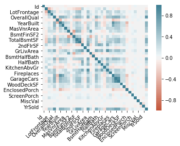


```python
sns.pairplot(df_raw)
```

    C:\Users\Alan\Anaconda3\envs\ai\lib\site-packages\numpy\lib\histograms.py:754: RuntimeWarning: invalid value encountered in greater_equal
      keep = (tmp_a >= first_edge)
    C:\Users\Alan\Anaconda3\envs\ai\lib\site-packages\numpy\lib\histograms.py:755: RuntimeWarning: invalid value encountered in less_equal
      keep &= (tmp_a <= last_edge)
    


    <seaborn.axisgrid.PairGrid at 0x197846c2f60>


```python
sns.pairplot(data = df_raw, vars=['SalePrice','GrLivArea','LotFrontage','LotArea','YrSold','TotRmsAbvGrd'])
```

    C:\Users\Alan\Anaconda3\envs\ai\lib\site-packages\numpy\lib\histograms.py:754: RuntimeWarning: invalid value encountered in greater_equal
      keep = (tmp_a >= first_edge)
    C:\Users\Alan\Anaconda3\envs\ai\lib\site-packages\numpy\lib\histograms.py:755: RuntimeWarning: invalid value encountered in less_equal
      keep &= (tmp_a <= last_edge)
    


    <seaborn.axisgrid.PairGrid at 0x2430966c9b0>


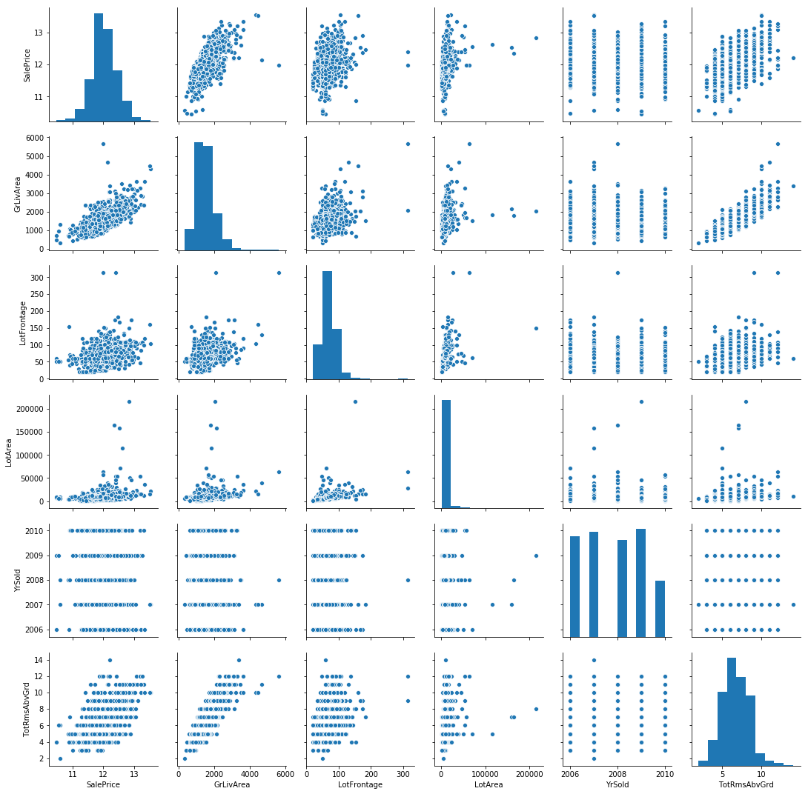


```python
fig, ax = plt.subplots()
ax.scatter(x = df_raw['GrLivArea'], y = df_raw['SalePrice'])
plt.ylabel('SalePrice', fontsize=13)
plt.xlabel('GrLivArea', fontsize=13)
plt.show()
```


```python
df_raw[['SalePrice','OverallQual']].groupby('OverallQual').mean().plot()
```


    <matplotlib.axes._subplots.AxesSubplot at 0x2430a66e9b0>


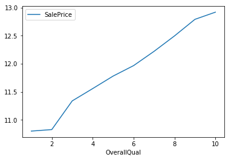


```python
years = df_raw['YearBuilt'].unique().tolist()
len(years)
```


    112


```python
df_raw['elapse']= df_raw['YearRemodAdd']-df_raw['YearBuilt']
df_test['elapse']= df_test['YearRemodAdd']-df_test['YearBuilt']
```


```python
df_raw.head()
```


<div>
<style scoped>
    .dataframe tbody tr th:only-of-type {
        vertical-align: middle;
    }

    .dataframe tbody tr th {
        vertical-align: top;
    }

    .dataframe thead th {
        text-align: right;
    }
</style>
<table border="1" class="dataframe">
  <thead>
    <tr style="text-align: right;">
      <th></th>
      <th>Id</th>
      <th>MSSubClass</th>
      <th>MSZoning</th>
      <th>LotFrontage</th>
      <th>LotArea</th>
      <th>Street</th>
      <th>Alley</th>
      <th>LotShape</th>
      <th>LandContour</th>
      <th>Utilities</th>
      <th>...</th>
      <th>PoolQC</th>
      <th>Fence</th>
      <th>MiscFeature</th>
      <th>MiscVal</th>
      <th>MoSold</th>
      <th>YrSold</th>
      <th>SaleType</th>
      <th>SaleCondition</th>
      <th>SalePrice</th>
      <th>elapse</th>
    </tr>
  </thead>
  <tbody>
    <tr>
      <th>0</th>
      <td>1</td>
      <td>60</td>
      <td>RL</td>
      <td>65.0</td>
      <td>8450</td>
      <td>Pave</td>
      <td>NaN</td>
      <td>Reg</td>
      <td>Lvl</td>
      <td>AllPub</td>
      <td>...</td>
      <td>NaN</td>
      <td>NaN</td>
      <td>NaN</td>
      <td>0</td>
      <td>2</td>
      <td>2008</td>
      <td>WD</td>
      <td>Normal</td>
      <td>12.247699</td>
      <td>0</td>
    </tr>
    <tr>
      <th>1</th>
      <td>2</td>
      <td>20</td>
      <td>RL</td>
      <td>80.0</td>
      <td>9600</td>
      <td>Pave</td>
      <td>NaN</td>
      <td>Reg</td>
      <td>Lvl</td>
      <td>AllPub</td>
      <td>...</td>
      <td>NaN</td>
      <td>NaN</td>
      <td>NaN</td>
      <td>0</td>
      <td>5</td>
      <td>2007</td>
      <td>WD</td>
      <td>Normal</td>
      <td>12.109016</td>
      <td>0</td>
    </tr>
    <tr>
      <th>2</th>
      <td>3</td>
      <td>60</td>
      <td>RL</td>
      <td>68.0</td>
      <td>11250</td>
      <td>Pave</td>
      <td>NaN</td>
      <td>IR1</td>
      <td>Lvl</td>
      <td>AllPub</td>
      <td>...</td>
      <td>NaN</td>
      <td>NaN</td>
      <td>NaN</td>
      <td>0</td>
      <td>9</td>
      <td>2008</td>
      <td>WD</td>
      <td>Normal</td>
      <td>12.317171</td>
      <td>1</td>
    </tr>
    <tr>
      <th>3</th>
      <td>4</td>
      <td>70</td>
      <td>RL</td>
      <td>60.0</td>
      <td>9550</td>
      <td>Pave</td>
      <td>NaN</td>
      <td>IR1</td>
      <td>Lvl</td>
      <td>AllPub</td>
      <td>...</td>
      <td>NaN</td>
      <td>NaN</td>
      <td>NaN</td>
      <td>0</td>
      <td>2</td>
      <td>2006</td>
      <td>WD</td>
      <td>Abnorml</td>
      <td>11.849405</td>
      <td>55</td>
    </tr>
    <tr>
      <th>4</th>
      <td>5</td>
      <td>60</td>
      <td>RL</td>
      <td>84.0</td>
      <td>14260</td>
      <td>Pave</td>
      <td>NaN</td>
      <td>IR1</td>
      <td>Lvl</td>
      <td>AllPub</td>
      <td>...</td>
      <td>NaN</td>
      <td>NaN</td>
      <td>NaN</td>
      <td>0</td>
      <td>12</td>
      <td>2008</td>
      <td>WD</td>
      <td>Normal</td>
      <td>12.429220</td>
      <td>0</td>
    </tr>
  </tbody>
</table>
<p>5 rows × 82 columns</p>
</div>


```python
#remember where to divide train and test
ntrain = df_raw.shape[0]
ntest = df_test.shape[0]

#Save the 'Id' column
train_ID = df_raw['Id']
test_ID = df_test['Id']
```


```python
def concat_df(train_data, test_data):
    # Returns a concatenated df of training and test set on axis 0
    return pd.concat([train_data, test_data], sort=True).reset_index(drop=True)

df_all = concat_df(df_raw, df_test)

df_raw.name = 'Training Set'
df_test.name = 'Test Set'
df_all.name = 'All Set' 

dfs = [df_raw, df_test]

df_all.shape
```


    (2919, 82)


```python
df_all.drop('Id',axis=1,inplace=True)
```


```python
for col in ('Alley','MasVnrType','BsmtQual', 'BsmtCond', 'BsmtExposure', 'BsmtFinType1', 
            'BsmtFinType2','FireplaceQu','GarageType', 'GarageFinish', 'GarageQual', 
            'GarageCond','PoolQC','Fence','MiscFeature','MSZoning'):
    df_all[col] = df_all[col].fillna('None')
```


```python
for col in ('GarageYrBlt', 'GarageArea', 'GarageCars','BsmtFinSF1', 'BsmtFinSF2', 'BsmtUnfSF','TotalBsmtSF', 'BsmtFullBath', 'BsmtHalfBath','MasVnrArea'):
    df_all[col] = df_all[col].fillna(0)
```


```python
numerics = ['int16', 'int32', 'int64', 'float16', 'float32', 'float64']
skewness = df_all.select_dtypes(include=numerics).apply(lambda x: skew(x))
skew_index = skewness[abs(skewness) >= 0.85].index
skewness[skew_index].sort_values(ascending=False)
```


    MiscVal          21.947195
    PoolArea         16.898328
    LotArea          12.822431
    LowQualFinSF     12.088761
    3SsnPorch        11.376065
    KitchenAbvGr      4.302254
    BsmtFinSF2        4.146143
    EnclosedPorch     4.003891
    ScreenPorch       3.946694
    BsmtHalfBath      3.931594
    MasVnrArea        2.613592
    OpenPorchSF       2.535114
    elapse            2.063712
    WoodDeckSF        1.842433
    1stFlrSF          1.469604
    BsmtFinSF1        1.425230
    MSSubClass        1.375457
    GrLivArea         1.269358
    TotalBsmtSF       1.156894
    BsmtUnfSF         0.919339
    2ndFlrSF          0.861675
    GarageYrBlt      -3.906205
    dtype: float64


```python
lam = 0.15

for column in skew_index:
    df_all[column] = boxcox1p(df_all[column], lam)
```


```python
df_train=df_all.iloc[:ntrain].copy()
```


```python
dftest = df_all.iloc[ntrain:].copy()
```


```python
cont_list, cat_list = cont_cat_split(df=df_train, max_card=10, dep_var='SalePrice')
```


```python
cont_list
```


    ['1stFlrSF',
     '2ndFlrSF',
     '3SsnPorch',
     'BsmtFinSF1',
     'BsmtFinSF2',
     'BsmtFullBath',
     'BsmtHalfBath',
     'BsmtUnfSF',
     'EnclosedPorch',
     'GarageArea',
     'GarageCars',
     'GarageYrBlt',
     'GrLivArea',
     'KitchenAbvGr',
     'LotArea',
     'LotFrontage',
     'LowQualFinSF',
     'MSSubClass',
     'MasVnrArea',
     'MiscVal',
     'OpenPorchSF',
     'PoolArea',
     'ScreenPorch',
     'TotalBsmtSF',
     'WoodDeckSF',
     'elapse']


```python
tfm = Categorify(cat_list, cont_list)
tfm(df_train)
tfm(dftest, test=True)
```


```python
tfmm = FillMissing(cat_list, cont_list)
tfmm(df_train)
tfmm(dftest, test=True)
```


```python
norm = Normalize(cat_list, cont_list)
norm.apply_train(df_train)
norm.apply_test(dftest)
```


```python
def numericalize(df, col, name, max_n_cat):
    """ Changes the column col from a categorical type to it's integer codes.

    Parameters:
    -----------
    df: A pandas dataframe. df[name] will be filled with the integer codes from
        col.

    col: The column you wish to change into the categories.
    name: The column name you wish to insert into df. This column will hold the
        integer codes.

    max_n_cat: If col has more categories than max_n_cat it will not change the
        it to its integer codes. If max_n_cat is None, then col will always be
        converted.
    """
    if not is_numeric_dtype(col) and ( max_n_cat is None or len(col.cat.categories)>max_n_cat):
        df[name] = col.cat.codes+1
```


```python
from pandas.api.types import is_string_dtype, is_numeric_dtype
def proc_df(df, y_fld=None, skip_flds=None, ignore_flds=None, do_scale=False, na_dict=None,
            preproc_fn=None, max_n_cat=None, subset=None, mapper=None):
    """ proc_df takes a data frame df and splits off the response variable, and
    changes the df into an entirely numeric dataframe.

    Parameters:
    -----------
    df: The data frame you wish to process.

    y_fld: The name of the response variable

    skip_flds: A list of fields that dropped from df.

    ignore_flds: A list of fields that are ignored during processing.

    do_scale: Standardizes each column in df. Takes Boolean Values(True,False)

    na_dict: a dictionary of na columns to add. Na columns are also added if there
        are any missing values.

    preproc_fn: A function that gets applied to df.

    max_n_cat: The maximum number of categories to break into dummy values, instead
        of integer codes.

    subset: Takes a random subset of size subset from df.

    mapper: If do_scale is set as True, the mapper variable
        calculates the values used for scaling of variables during training time (mean and standard deviation).

    Returns:
    --------
    [x, y, nas, mapper(optional)]:

        x: x is the transformed version of df. x will not have the response variable
            and is entirely numeric.

        y: y is the response variable

        nas: returns a dictionary of which nas it created, and the associated median.

        mapper: A DataFrameMapper which stores the mean and standard deviation of the corresponding continuous
        variables which is then used for scaling of during test-time.

 
    """
    if not ignore_flds: ignore_flds=[]
    if not skip_flds: skip_flds=[]
    if subset: df = get_sample(df,subset)
    else: df = df.copy()
    ignored_flds = df.loc[:, ignore_flds]
    df.drop(ignore_flds, axis=1, inplace=True)
    if preproc_fn: preproc_fn(df)
    if y_fld is None: y = None
    else:
        if not is_numeric_dtype(df[y_fld]): df[y_fld] = df[y_fld].cat.codes
        y = df[y_fld].values
        skip_flds += [y_fld]
    df.drop(skip_flds, axis=1, inplace=True)

    for n,c in df.items(): numericalize(df, c, n, max_n_cat)
    df = pd.get_dummies(df, dummy_na=True)
    df = pd.concat([ignored_flds, df], axis=1)
    res = [df, y, na_dict]
    if do_scale: res = res + [mapper]
    return res
```


```python
df, y, nas = proc_df(df_train, 'SalePrice')
```


```python
def split_vals(a,n): return a[:n].copy(), a[n:].copy()

n_valid = 364 
n_trn = len(df)-n_valid
raw_train, raw_valid = split_vals(df_raw, n_trn)
X_train, X_valid = split_vals(df, n_trn)
y_train, y_valid = split_vals(y, n_trn)

X_train.shape, y_train.shape, X_valid.shape
```


    ((1096, 81), (1096,), (364, 81))


```python
def rmse(x,y): return math.sqrt(((x-y)**2).mean())

def print_score(m):
    res = [rmse(m.predict(X_train), y_train), rmse(m.predict(X_valid), y_valid),
                m.score(X_train, y_train), m.score(X_valid, y_valid)]
    if hasattr(m, 'oob_score_'): res.append(m.oob_score_)
    print(res)
```


```python
m = RandomForestRegressor(n_estimators=80, n_jobs=-1, oob_score=True)
m.fit(X_train, y_train)
print_score(m)
```

    [0.05443547979354022, 0.14397467866421346, 0.9818559498185528, 0.8597465984930929, 0.864632218185491]
    


```python
m = RandomForestRegressor(n_estimators=80, min_samples_leaf=3, n_jobs=-1, oob_score=True)
m.fit(X_train, y_train)
print_score(m)
```

    [0.07674633347960227, 0.14435488793439705, 0.9639350444771443, 0.8590048561912306, 0.8643927074680673]
    


```python
m = RandomForestRegressor(n_estimators=80,max_features=.5, n_jobs=-1, oob_score=True)
m.fit(X_train, y_train)
print_score(m)
```

    [0.0524782016168199, 0.13515238581217734, 0.9831372649827054, 0.8764085008519842, 0.8716314489218046]
    


```python
def rf_feat_importance(m, df):
    return pd.DataFrame({'cols':df.columns, 'imp':m.feature_importances_}
                       ).sort_values('imp', ascending=False)
```


```python
fi = rf_feat_importance(m, df); fi[:10]
```


<div>
<style scoped>
    .dataframe tbody tr th:only-of-type {
        vertical-align: middle;
    }

    .dataframe tbody tr th {
        vertical-align: top;
    }

    .dataframe thead th {
        text-align: right;
    }
</style>
<table border="1" class="dataframe">
  <thead>
    <tr style="text-align: right;">
      <th></th>
      <th>cols</th>
      <th>imp</th>
    </tr>
  </thead>
  <tbody>
    <tr>
      <th>62</th>
      <td>OverallQual</td>
      <td>0.314447</td>
    </tr>
    <tr>
      <th>38</th>
      <td>GrLivArea</td>
      <td>0.146144</td>
    </tr>
    <tr>
      <th>76</th>
      <td>YearBuilt</td>
      <td>0.114264</td>
    </tr>
    <tr>
      <th>73</th>
      <td>TotalBsmtSF</td>
      <td>0.043224</td>
    </tr>
    <tr>
      <th>32</th>
      <td>GarageCars</td>
      <td>0.040638</td>
    </tr>
    <tr>
      <th>22</th>
      <td>ExterQual</td>
      <td>0.035677</td>
    </tr>
    <tr>
      <th>31</th>
      <td>GarageArea</td>
      <td>0.032852</td>
    </tr>
    <tr>
      <th>0</th>
      <td>1stFlrSF</td>
      <td>0.032718</td>
    </tr>
    <tr>
      <th>8</th>
      <td>BsmtFinSF1</td>
      <td>0.018100</td>
    </tr>
    <tr>
      <th>27</th>
      <td>Fireplaces</td>
      <td>0.016589</td>
    </tr>
  </tbody>
</table>
</div>


```python
def plot_fi(fi): return fi.plot('cols', 'imp', 'barh', figsize=(12,7), legend=False)
```


```python
plot_fi(fi[:30]);
```


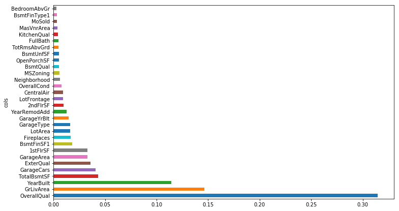


```python
to_keep = fi[fi.imp>0.02].cols; len(to_keep)
```


    8


```python
df_keep = df[to_keep].copy()
X_train, X_valid = split_vals(df_keep, n_trn)
```


```python
m = RandomForestRegressor(n_estimators=80, min_samples_leaf=3,max_features=.5, n_jobs=-1, oob_score=True)
m.fit(X_train, y_train)
print_score(m)
```

    [0.1071102794233505, 0.15815675429160073, 0.9297522477256488, 0.8307546853799567, 0.8289786612747053]
    


```python
df_trn2, y_trn, nas = proc_df(df_train, 'SalePrice', max_n_cat=7)
X_train, X_valid = split_vals(df_trn2, n_trn)
```


```python
m = RandomForestRegressor(n_estimators=80, min_samples_leaf=3,max_features=.5, n_jobs=-1, oob_score=True)
m.fit(X_train, y_train)
print_score(m)
```

    [0.07845749487101976, 0.1373798540014952, 0.9623088835174025, 0.8723010671421518, 0.8700502185234948]
    


```python
fi = rf_feat_importance(m, df_trn2)
plot_fi(fi[:25]);
```


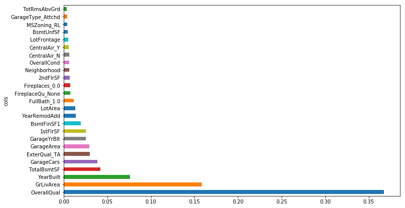


```python
to_keep = fi[fi.imp>0.01].cols; len(to_keep)
```


    13


```python
df_keep = df_trn2[to_keep].copy()
X_train, X_valid = split_vals(df_keep, n_trn)
```


```python
m = RandomForestRegressor(n_estimators=80,max_features=.5, n_jobs=-1, oob_score=True)
m.fit(X_train, y_train)
print_score(m)
```

    [0.05648442922675345, 0.14908580761042742, 0.9804643611837447, 0.8496117964429375, 0.8552116892524549]
    


```python
from scipy.cluster import hierarchy as hc
```


```python
corr = np.round(scipy.stats.spearmanr(df_keep).correlation, 4)
corr_condensed = hc.distance.squareform(1-corr)
z = hc.linkage(corr_condensed, method='average')
fig = plt.figure(figsize=(16,10))
dendrogram = hc.dendrogram(z, labels=df_keep.columns, orientation='left', leaf_font_size=16)
plt.show()
```


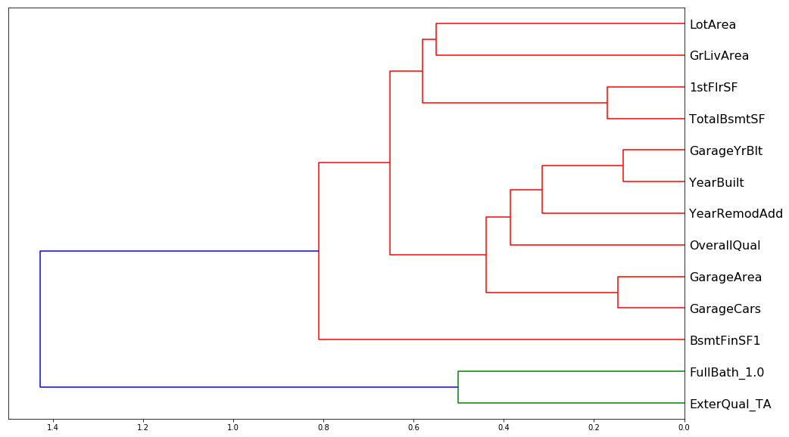


```python
def get_oob(df):
    m = RandomForestRegressor(n_estimators=30, min_samples_leaf=5, max_features=0.6, n_jobs=-1, oob_score=True)
    x, _ = split_vals(df, n_trn)
    m.fit(x, y_train)
    return m.oob_score_
```


```python
get_oob(df_keep)
```


    0.8447958632086807


```python
for c in ('GarageArea','GarageCars','1stFlrSF','TotalBsmtSF'):
    print(c, get_oob(df_keep.drop(c, axis=1)))
```

    GarageArea 0.8498654239727708
    GarageCars 0.8461762459437419
    1stFlrSF 0.8453439631559331
    TotalBsmtSF 0.8509981515818017
    


```python
to_drop = [ '1stFlrSF']
get_oob(df_keep.drop(to_drop, axis=1))
```


    0.8486419135681285


```python
df_keep.drop(to_drop, axis=1, inplace=True)
X_train, X_valid = split_vals(df_keep, n_trn)
```


```python
m = RandomForestRegressor(n_estimators=80,max_features=.5, n_jobs=-1, oob_score=True)
m.fit(X_train, y_train)
print_score(m)
```

    [0.057007388512122684, 0.14823866483700518, 0.9801009464267504, 0.8513160273391139, 0.8596525096070278]
    


```python
from pdpbox import pdp
from plotnine import *
```


```python
df_trn2, y_trn, nas = proc_df(df_train, 'SalePrice', max_n_cat=7)
X_train, X_valid = split_vals(df_trn2, n_trn)
m = RandomForestRegressor(n_estimators=80,max_features=.5, n_jobs=-1)
m.fit(X_train, y_train);
```


```python
plot_fi(rf_feat_importance(m, df_trn2)[:10]);
```


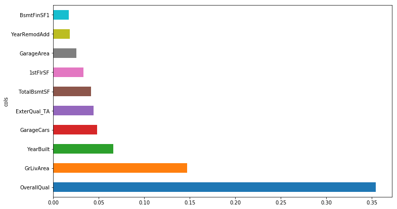


```python
df_raw.plot('YearBuilt', 'OverallQual', 'scatter', alpha=0.05, figsize=(10,8));
```


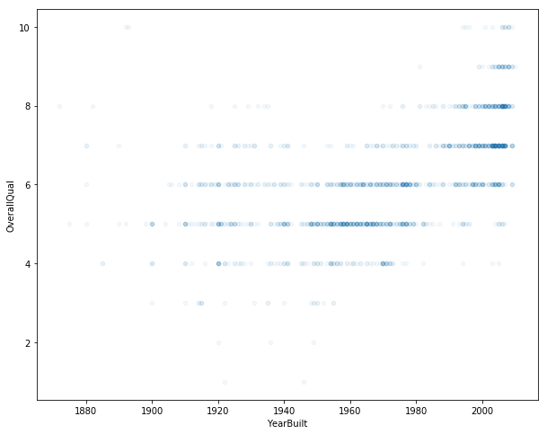


```python
ggplot(df_raw, aes('YearBuilt', 'SalePrice'))+stat_smooth(se=True, method='loess')
```


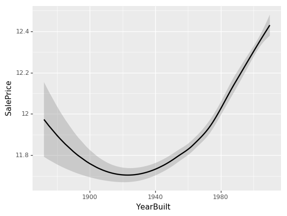


    <ggplot: (81397489058)>


```python
x = X_train
```


```python
def plot_pdp(feat_name, clusters=None):
    #feat_name = feat_name or feat
    p = pdp.pdp_isolate(m, x, feature=feat_name, model_features=x.columns)
    return pdp.pdp_plot(p, feat_name, plot_lines=True,
                        cluster=clusters is not None,
                        n_cluster_centers=clusters)
```


```python
plot_pdp('YearBuilt')
```


    (<Figure size 1080x684 with 2 Axes>,
     {'title_ax': <matplotlib.axes._subplots.AxesSubplot at 0x12f3a9e0b70>,
      'pdp_ax': <matplotlib.axes._subplots.AxesSubplot at 0x12f3aa53128>})


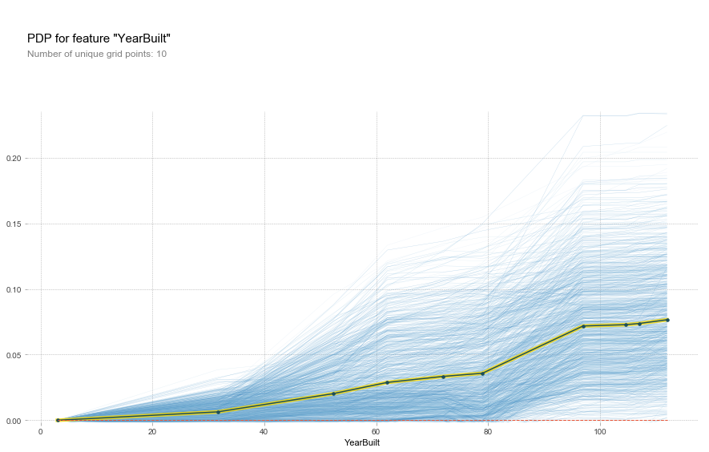


```python
plot_pdp('YearBuilt', clusters=5)
```


    (<Figure size 1080x684 with 2 Axes>,
     {'title_ax': <matplotlib.axes._subplots.AxesSubplot at 0x12f3ac21668>,
      'pdp_ax': <matplotlib.axes._subplots.AxesSubplot at 0x12f3ac342b0>})


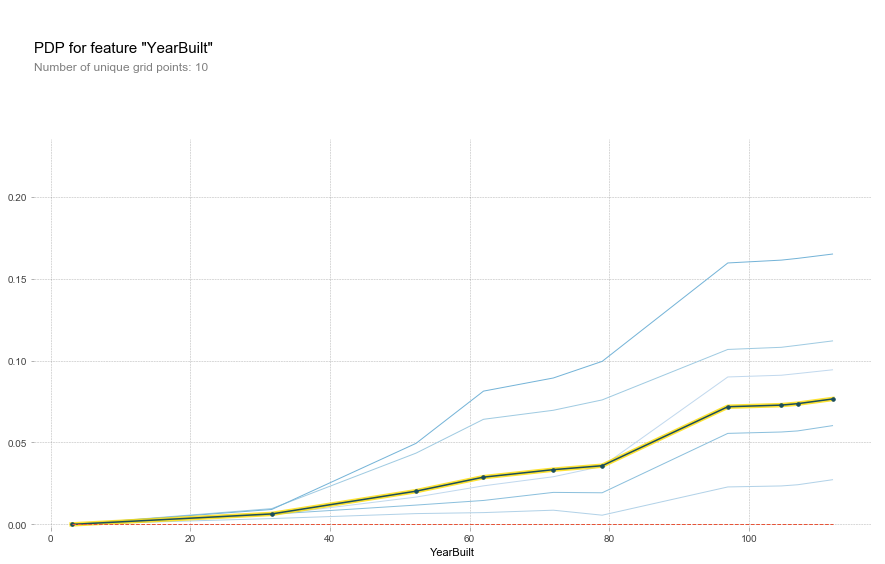


```python
feats = ['OverallQual', 'YearBuilt']
p = pdp.pdp_interact(m, x, features=feats, model_features=x.columns)
pdp.pdp_interact_plot(p, feats)
```

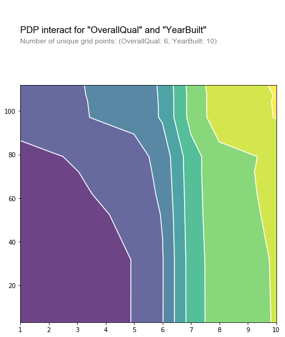


<h3>Using Neural Networks</h3>


```python
dep_var = 'SalePrice'
```


```python
train=df_all.iloc[:ntrain].copy()
```


```python
test=df_all.iloc[ntrain:].copy()
```


```python
procs = [FillMissing, Normalize, Categorify]
```


```python
data = (TabularList.from_df(train, path=PATH, cont_names=cont_list,cat_names=cat_list,procs=procs)
                           .split_by_rand_pct(valid_pct=0.2, seed=10)
                           .label_from_df(cols=dep_var, label_cls=FloatList)
                            .add_test(TabularList.from_df(dftest, path=PATH, cont_names=cont_list,cat_names=cat_list))
                           .databunch())
```


```python
max_log_y = np.max(df_raw['SalePrice'])*1.5
y_range = torch.tensor([0, max_log_y], device=defaults.device)
```


```python
learn = tabular_learner(data, layers=[200,100], emb_drop=0.2, wd= 0.1, y_range=y_range,
                        metrics=root_mean_squared_error,callback_fns=ActivationStats)
```


```python
learn.lr_find()
```


    LR Finder is complete, type {learner_name}.recorder.plot() to see the graph.
    


```python
learn.recorder.plot()
```


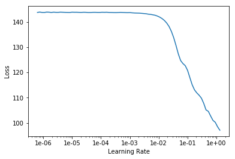


```python
learn.fit_one_cycle(20, 5e-02)
```


<table border="1" class="dataframe">
  <thead>
    <tr style="text-align: left;">
      <th>epoch</th>
      <th>train_loss</th>
      <th>valid_loss</th>
      <th>root_mean_squared_error</th>
      <th>time</th>
    </tr>
  </thead>
  <tbody>
    <tr>
      <td>0</td>
      <td>2.866207</td>
      <td>0.262806</td>
      <td>0.510077</td>
      <td>01:01</td>
    </tr>
    <tr>
      <td>1</td>
      <td>1.404347</td>
      <td>0.120272</td>
      <td>0.346023</td>
      <td>01:09</td>
    </tr>
    <tr>
      <td>2</td>
      <td>0.851733</td>
      <td>0.125121</td>
      <td>0.352997</td>
      <td>01:10</td>
    </tr>
    <tr>
      <td>3</td>
      <td>0.542759</td>
      <td>0.078273</td>
      <td>0.279022</td>
      <td>01:08</td>
    </tr>
    <tr>
      <td>4</td>
      <td>0.370156</td>
      <td>0.039735</td>
      <td>0.198528</td>
      <td>01:09</td>
    </tr>
    <tr>
      <td>5</td>
      <td>0.258581</td>
      <td>0.103686</td>
      <td>0.320902</td>
      <td>01:08</td>
    </tr>
    <tr>
      <td>6</td>
      <td>0.191711</td>
      <td>0.022969</td>
      <td>0.148145</td>
      <td>01:08</td>
    </tr>
    <tr>
      <td>7</td>
      <td>0.140206</td>
      <td>0.032180</td>
      <td>0.178643</td>
      <td>01:08</td>
    </tr>
    <tr>
      <td>8</td>
      <td>0.104134</td>
      <td>0.028513</td>
      <td>0.167604</td>
      <td>01:09</td>
    </tr>
    <tr>
      <td>9</td>
      <td>0.078625</td>
      <td>0.019990</td>
      <td>0.139204</td>
      <td>01:08</td>
    </tr>
    <tr>
      <td>10</td>
      <td>0.061806</td>
      <td>0.029424</td>
      <td>0.170236</td>
      <td>01:10</td>
    </tr>
    <tr>
      <td>11</td>
      <td>0.049266</td>
      <td>0.018197</td>
      <td>0.132504</td>
      <td>01:09</td>
    </tr>
    <tr>
      <td>12</td>
      <td>0.038017</td>
      <td>0.020812</td>
      <td>0.142132</td>
      <td>01:09</td>
    </tr>
    <tr>
      <td>13</td>
      <td>0.031606</td>
      <td>0.020661</td>
      <td>0.142040</td>
      <td>01:09</td>
    </tr>
    <tr>
      <td>14</td>
      <td>0.026538</td>
      <td>0.019730</td>
      <td>0.137117</td>
      <td>01:08</td>
    </tr>
    <tr>
      <td>15</td>
      <td>0.021316</td>
      <td>0.020949</td>
      <td>0.142341</td>
      <td>01:11</td>
    </tr>
    <tr>
      <td>16</td>
      <td>0.017964</td>
      <td>0.020266</td>
      <td>0.139862</td>
      <td>01:08</td>
    </tr>
    <tr>
      <td>17</td>
      <td>0.015043</td>
      <td>0.018141</td>
      <td>0.131634</td>
      <td>01:09</td>
    </tr>
    <tr>
      <td>18</td>
      <td>0.012978</td>
      <td>0.018125</td>
      <td>0.131827</td>
      <td>01:09</td>
    </tr>
    <tr>
      <td>19</td>
      <td>0.010632</td>
      <td>0.017970</td>
      <td>0.131334</td>
      <td>01:09</td>
    </tr>
  </tbody>
</table>


```python
learn.activation_stats.stats.shape
```


    torch.Size([2, 61, 360])


```python
for o in learn.activation_stats.stats[1]: plt.plot(o)
plt.legend(range(5));
```


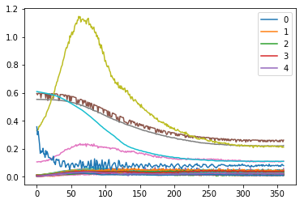


```python
for o in learn.activation_stats.stats[0]: plt.plot(o)
plt.legend(range(5));
```


```python
data = (TabularList.from_df(train, path=PATH, cont_names=cont_list,cat_names=cat_list,procs=procs)
                           .split_by_rand_pct(valid_pct=0.2, seed=207)
                           .label_from_df(cols=dep_var, label_cls=FloatList)
                            .add_test(TabularList.from_df(dftest, path=PATH, cont_names=cont_list,cat_names=cat_list))
                           .databunch())
```


```python
learn.lr_find()
```


    LR Finder is complete, type {learner_name}.recorder.plot() to see the graph.
    


```python
learn.recorder.plot()
```


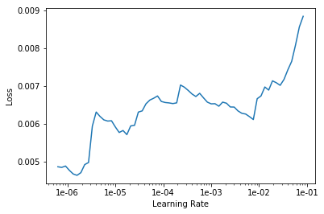


```python
learn.fit_one_cycle(5, 1e-06)
```


<table border="1" class="dataframe">
  <thead>
    <tr style="text-align: left;">
      <th>epoch</th>
      <th>train_loss</th>
      <th>valid_loss</th>
      <th>root_mean_squared_error</th>
      <th>time</th>
    </tr>
  </thead>
  <tbody>
    <tr>
      <td>0</td>
      <td>0.005646</td>
      <td>0.017863</td>
      <td>0.130982</td>
      <td>01:04</td>
    </tr>
    <tr>
      <td>1</td>
      <td>0.006053</td>
      <td>0.018020</td>
      <td>0.131524</td>
      <td>01:08</td>
    </tr>
    <tr>
      <td>2</td>
      <td>0.005808</td>
      <td>0.017867</td>
      <td>0.130777</td>
      <td>01:08</td>
    </tr>
    <tr>
      <td>3</td>
      <td>0.005922</td>
      <td>0.017863</td>
      <td>0.130867</td>
      <td>01:09</td>
    </tr>
    <tr>
      <td>4</td>
      <td>0.006210</td>
      <td>0.018107</td>
      <td>0.131788</td>
      <td>01:08</td>
    </tr>
  </tbody>
</table>


```python
pred_test,_ = learn.get_preds(DatasetType.Test)
```


```python
preds = np.exp(pred_test)
```


```python
preds = preds.numpy()
```


```python
preds
```


    array([[139982.5 ],
           [165435.78],
           [183989.84],
           [194965.  ],
           ...,
           [ 88244.87],
           [172395.67],
           [116483.23],
           [224348.78]], dtype=float32)


```python
submi = pd.DataFrame(preds,columns=['SalePrice'], index=df_test.Id)
```


```python
submi.to_csv(f'{PATH}NN2.csv', index_label='Id')
```
