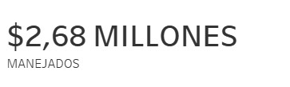
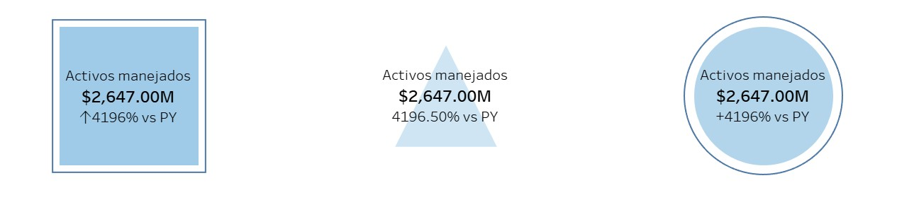
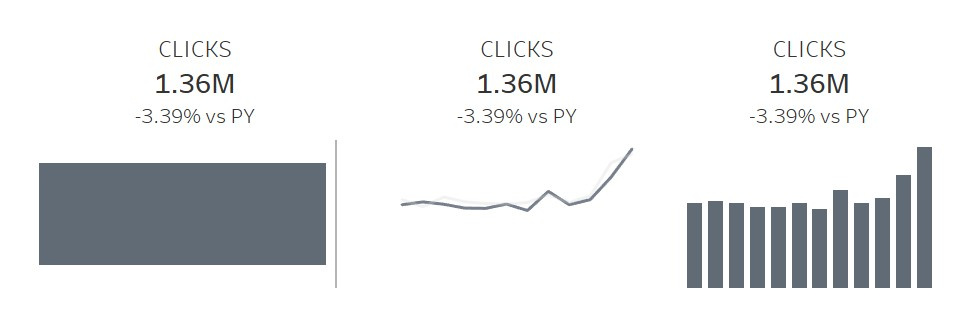

Una Introducción a los BANs
================
Alan 
2021 

<h3>¿Que son BANs?</h3>

BAN sus siglas en ingles es Big Agreggated Numbers o Grandes Números Agregados. 
Sirven para resumir los datos y para resaltar KPIs y números importantes.  

Un ejemplo de esto es el dashboard de abajo, el cual esta diseñado para dar una vista global de los KPI esenciales en marketing digital usando puros BANs.

<h3>Características de los BANs</h3>
 
•	El número agregado 
•	Contexto (Comparado contra año anterior, etc.) 
•	Tendencia (Incremento o decremento)  
 

<h3>Estilos de BANs</h3>

Existen diversas formas de usar BANs en dashboards. Todo depende de que se desea comunicar y el estilo que se desea en el dashboard. 
Todos los ejemplos fueron realizados en Tableau

<h4>Simple Texto</h4>

Es uno de los BANs más simples. Sin embargo, es sumamente efectivo cuando se quiere dar énfasis a un numero en específico. Cuando se necesita resaltar un número, texto es la mejor forma de presentar la información, siempre y cuando sea uno o dos números. 

<h4>Simple BAN</h4>

Una de las mejores formas de comunicar KPIs, en especial cuando se compara con periodos anteriores. 
 Dependiendo si es positivo o negativo el color y las flechas cambian para indicar la tendencia respecto al periodo pasado. 

<h4>Por Figuras</h4>

Una forma más estilizada, solo la figura de en medio tiene relación con la tendencia respecto a periodos anteriores. 
De igual forma que el estilo anterior, el color y, en caso de la figura de en medio, cambian dependiendo si la tendencia fue positiva o negativa. 

<h4>Combinando gráficas</h4>

 

