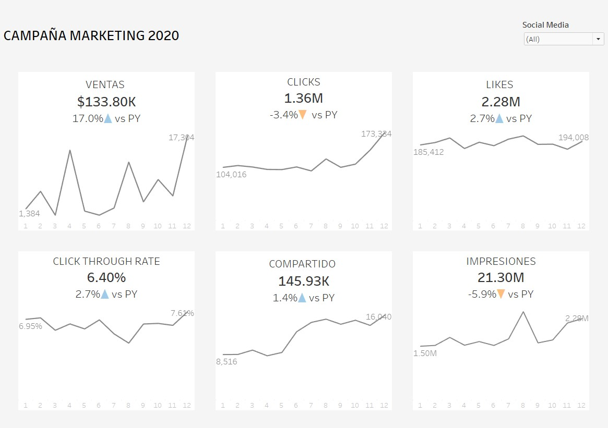

Una Introducción a los BANs
================
Alan 
2021 

<h3>¿Que son BANs?</h3>

BAN sus siglas en ingles es Big Agreggated Numbers o Grandes Números Agregados. 
Sirven para resumir los datos y para resaltar KPIs y números importantes.  

Un ejemplo de esto es el dashboard de abajo, el cual esta diseñado para dar una vista global de los KPI esenciales en marketing digital usando puros BANs.

<h3>Características de los BANs</h3>
 
•	El número agregado 
•	Contexto (Comparado contra año anterior, etc.) 
•	Tendencia (Incremento o decremento)  
 

<h3>Estilos de BANs</h3>

Existen diversas formas de usar BANs en dashboards. Todo depende de que se desea comunicar y el estilo que se desea en el dashboard.

<h4>Simple Texto</h4>

<h4>Simple BAN</h4>

<h4>Por Figuras</h4>

<!-- <h4>Combinando gráficas</h4>
  -->

