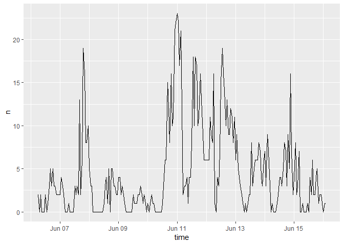
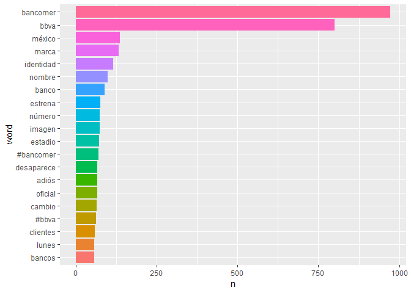
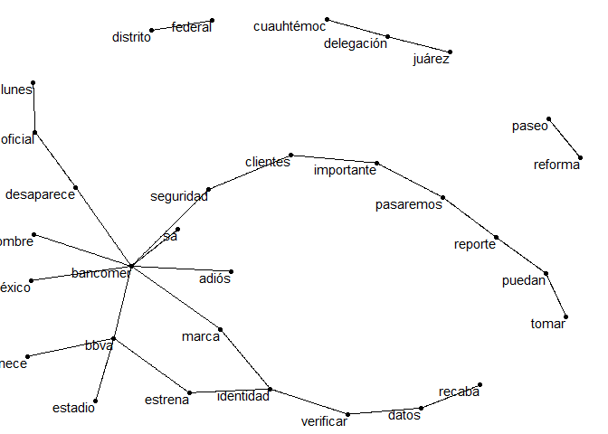
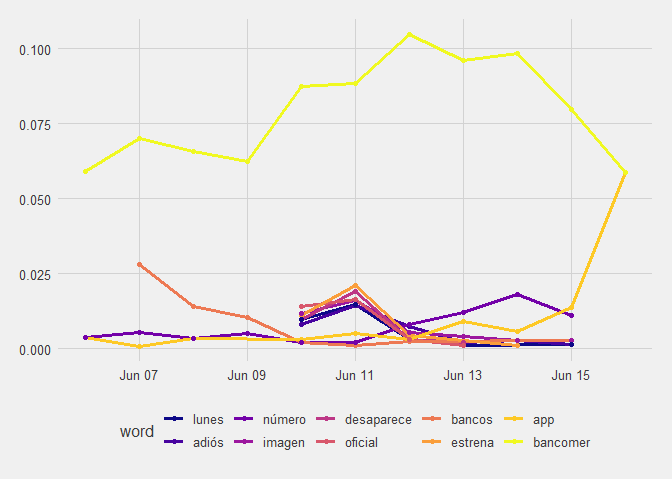
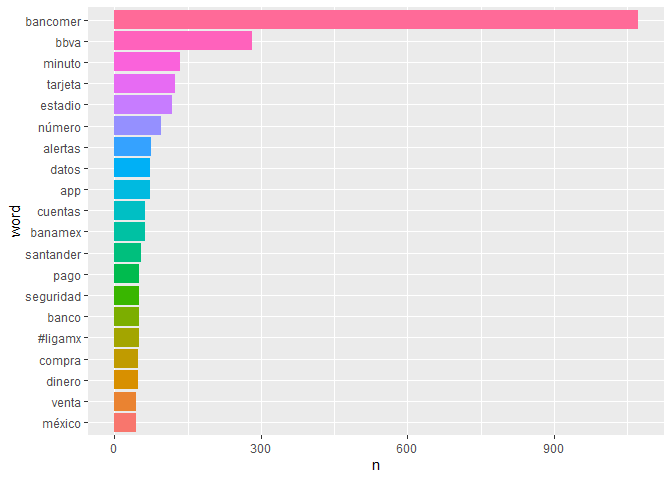
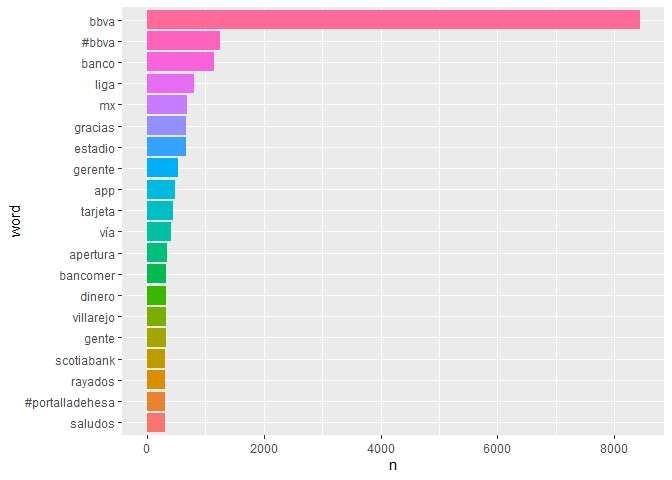

Data Mining BBVA
================
Alan
June 15/ December 2 , 2019

Análisis de Tweets sobre BBVA y Bancomer.
=================================================

El 15 de junio del 2019 BBVA eliminó la palabra Bancomer para consolidar su marca a nivel mundial.
Ese día se tomo una muestra de 1,100 tweets los cuales tuvieran la palabra o estuvieran referenciados a Bancomer, posteriormente se volvio a tomar otra muestra despues de 6 meses para ver si existe un cambio en los tweets.

15 de Junio 2019
----------------

Usando el paquete rtweets se obtuvieron 1,100 tweets que tuvieran la palabra 'Bancomer', la distribución por día de esos tweets queda de la siguiente forma: 

``` r
ts_plot(Tweets, by = "1 hours")
```



Para analizar los tweets, se deben de quitar cosas como emojis, URL, tweets de noticias asi como palabras comunes (ej. asi, de, a, etc.). Después se tienen que separar los tweets en palabras individuales lo cuales se logran con el paquete tidytext. Las 20 palabras mas usadas son:



Se observan palabras como identidad, marca, etc. por ser la semana la cual se realizó el cambio. Y la diferencia de menciones de bbva a bancomer es de aprox 150 menciones.

En vez de palabras individuales vemos como aparecen en conjunto, usando n-grams, el cual junta 2 palabras y las cuenta cuando el par de palabras ocurren.

``` r
 dat_bigram <- tidy_tweets %>%  group_by(tweet_number) %>%  summarise(text = str_c(word, collapse = " "))%>% 
   unnest_tokens(bigram, text, token = "ngrams", n = 2, collapse = FALSE)%>% 
   na.omit() %>% filter(!bigram %in% c("u fe0f", "bancomer u"))
 dat_bigram %>%
   count(bigram, sort = TRUE)%>%
   head(20)%>%
   kable(align = "c") 
```

|        bigram        |  n  |
|:--------------------:|:---:|
|     bbva bancomer    | 442 |
|     bancomer bbva    |  94 |
|     bbva estrena     |  74 |
|    marca bancomer    |  69 |
|     estadio bbva     |  64 |
|  bancomer desaparece |  59 |
|    identidad marca   |  55 |
|    adiós bancomer    |  53 |
|  desaparece oficial  |  52 |
|   estrena identidad  |  47 |
|    pertenece bbva    |  46 |
|     oficial lunes    |  44 |
|  seguridad clientes  |  37 |
|  clientes importante |  34 |
|  bancomer seguridad  |  32 |
| importante pasaremos |  32 |
|     paseo reforma    |  32 |
|    datos verificar   |  30 |
|   pasaremos reporte  |  30 |
|     recaba datos     |  30 |

<br/>
De los 20 conjuntos de palabras mas importantes 6 de estos son de bancomer, siendo los 2 primeros una combinacion de bbva y bancomer. Usamos una gráfica de redes para ver la relación entre las palabras:



Ahora veremos que palabras cambian rápidamente en el periodo de los tweets. O para decirlo de otra manera, ¿Que palabras se usan más o menos a lo largo del día? Para realizar esto, tenemos que definir contenedores de un periodo de tiempo y contar el número de palabras usadas dentro de esos contenedores y solo se usaran palabras que sean usadas un mínimo de 30 veces.

    ## # A tibble: 337 x 5
    ##    time_floor          word        count time_total word_total
    ##    <dttm>              <chr>       <int>      <int>      <int>
    ##  1 2019-06-06 00:00:00 #bbva           1        526         62
    ##  2 2019-06-06 00:00:00 app             2        526         54
    ##  3 2019-06-06 00:00:00 banco           4        526         90
    ##  4 2019-06-06 00:00:00 bancomer       31        526        973
    ##  5 2019-06-06 00:00:00 bbva           31        526        801
    ##  6 2019-06-06 00:00:00 clientes        9        526         59
    ##  7 2019-06-06 00:00:00 confirmamos     3        526         31
    ##  8 2019-06-06 00:00:00 cuauhtémoc      5        526         43
    ##  9 2019-06-06 00:00:00 datos           5        526         54
    ## 10 2019-06-06 00:00:00 estadio         5        526         72
    ## # ... with 327 more rows

La columna count nos indica las veces que se usó esa palabra en el contenedor de una hora, time\_total nos dice cuantas palabras se usaron en ese periodo de tiempo y word\_total indica cuantas veces se usó esa palabra en tod el periodo.

Tenemos que realizar un modelo general lineal para cada palabra. Estos modelos responden la pregunta ¿Fue esta palabra mencionada en algún contenedor? ¿Si o No? ¿Como el número de menciones de una palabra depende con el tiempo? Para realizar esto, para cada palabra se adjuntan los datos de cada contenedor y se adjunta el modelo generado.

    ## # A tibble: 39 x 3
    ##    word        data              models   
    ##    <chr>       <list>            <list>   
    ##  1 #bbva       <tibble [9 x 4]>  <S3: glm>
    ##  2 app         <tibble [10 x 4]> <S3: glm>
    ##  3 banco       <tibble [11 x 4]> <S3: glm>
    ##  4 bancomer    <tibble [11 x 4]> <S3: glm>
    ##  5 bbva        <tibble [10 x 4]> <S3: glm>
    ##  6 clientes    <tibble [10 x 4]> <S3: glm>
    ##  7 confirmamos <tibble [9 x 4]>  <S3: glm>
    ##  8 cuauhtémoc  <tibble [10 x 4]> <S3: glm>
    ##  9 datos       <tibble [10 x 4]> <S3: glm>
    ## 10 estadio     <tibble [10 x 4]> <S3: glm>
    ## # ... with 29 more rows

El resultado contiene la palabra, la columna data contiene los datos con los contenedores y la columna models contiene el modelo que corresponde a cada palabra.

Posteriormente extraemos las pendientes de cada modelo y buscamos las más importantes. Estamos comparando muchas pendientes por lo cual se aplica un ajuste a los valores p para realizar comparaciones múltiples, y se filtra para encontrar las pendientes más significativas.

    ## # A tibble: 10 x 7
    ##    word    term      estimate std.error statistic  p.value adjusted.p.value
    ##    <chr>   <chr>        <dbl>     <dbl>     <dbl>    <dbl>            <dbl>
    ##  1 app     time_f~    2.76e-6   7.50e-7      3.69 2.29e- 4  0.00731        
    ##  2 bancom~ time_f~    5.47e-7   1.62e-7      3.38 7.22e- 4  0.0217         
    ##  3 número  time_f~    2.58e-6   6.29e-7      4.10 4.07e- 5  0.00147        
    ##  4 bancos  time_f~   -6.44e-6   8.89e-7     -7.24 4.43e-13  0.0000000000173
    ##  5 adiós   time_f~   -4.25e-6   1.14e-6     -3.72 1.99e- 4  0.00658        
    ##  6 desapa~ time_f~   -5.80e-6   1.61e-6     -3.61 3.11e- 4  0.00964        
    ##  7 estrena time_f~   -5.66e-6   1.39e-6     -4.06 4.90e- 5  0.00172        
    ##  8 imagen  time_f~   -4.61e-6   1.10e-6     -4.18 2.94e- 5  0.00109        
    ##  9 lunes   time_f~   -6.20e-6   1.56e-6     -3.99 6.67e- 5  0.00227        
    ## 10 oficial time_f~   -7.68e-6   1.70e-6     -4.52 6.08e- 6  0.000231

Visualizando los resultados obtenemos la siguiente grafica.



Podemos observar que la palabra mas usada y la que mas cambia a lo largo del tiempo es Bancomer. La
palabra que mas salta, especificamente al final es estrena. Interesantemente BBVA no aparece.
<br/>
Dejando pasar 6 meses queremos ver como ha cambiado el uso de estas palabras y que tanto la gente sigue usando la palabra Bancomer.

2 de Diciembre del 2019
----------------

Nuevamente se descargaron tweets que tuvieran la palabra 'Bancomer' y separamos por palabras individuales quitando palabras no relevantes.



Vemos que la palabra Bancomer aparece 1,000 como la vez pasada, sin embargo la diferencia contra bbva es casi el doble, por lo cual vemos que existe una separación de tweets que refieren a bancomer y bbva.

Juntando la palabras en pares para ver cuales con las que más se utilizan nos da la siguiente tabla:


|          bigram          |  n  |
|:------------------------:|:---:|
|       bbva bancomer      | 245 |
|       estadio bbva       | 112 |
|     alertas bancomer     |  74 |
|       minuto minuto      |  67 |
|       único número       |  39 |
|     código seguridad     |  38 |
|        cuentas nip       |  38 |
|        nip código        |  38 |
|       sigue minuto       |  38 |
|    solicitaremos datos   |  38 |
|     tarjeta bancomer     |  38 |
| monarcasmorelia clubleon |  36 |
|       claves acceso      |  35 |
|     mensajes alertas     |  35 |
|    recibirás mensajes    |  35 |
|     seguridad claves     |  35 |
|     número recibirás     |  34 |
|  bancomer solicitaremos  |  30 |
|       compra venta       |  30 |
|      datos sensibles     |  28 |

<br/>
El primer cambio que se observa es que bbva bancomer bajo de 442 a 245, si aún existen menciones, pero es una disminución significante. Tambien de los 20 conjuntas mas usados 4 son relacionados con bancomer, 2 menos que en junio. Otro número significativo es, en junio la suma del conjunto de palabras que contiene bancomer es 749 el cual disminuyo a 387 en diciembre.


BBVA en diciembre
----------------

Finalmente descargamos tweets que contienen la palabra 'bbva', para observar como el volumen de los tweets incrementa a comparación de usar 'Bancomer'.


Vemos que existe una mayor actividad ya que los tweets que se descargan provienen de todos los paises. Quitando el mayor número de paises mencionados para tratar de buscar tweets que surgan en México obtenemos la siguiente gráfica.



Interesantemente sigue apareciendo bancomer en el lugar 13, sin embargo comparado con bbva es insignificante.
Vemos el conjunto de palabra que más aparecen y obtenemos una sorpresa:

|        bigram       |  n  |
|:-------------------:|:---:|
|      liga bbva      | 645 |
|       bbva mx       | 580 |
|     estadio bbva    | 496 |
|     garanti bbva    | 251 |
|    bbva bancomer    | 245 |
|      banco bbva     | 151 |
|     gerente bbva    | 151 |
|   bbva scotiabank   | 150 |
|  antonio benvenuto  | 130 |
|    apertura liga    | 128 |
|    santander bbva   | 117 |
|     mx apertura     | 113 |
|       liga mx       | 102 |
|    rayados santos   |  98 |
| ligamx sientetuliga |  97 |
|   scotiabank bbva   |  95 |
|       app bbva      |  94 |
|      bbva banco     |  90 |
|  política comercial |  89 |
|   tarjeta crédito   |  84 |

<br/>
El par de bbva bancomer es el 5 más utilizado con 245 ocurrencias, sin embargo, bancomer ahora solo aparece 1 vez.

En conclusión, BBVA ha hecho un buen esfuerzo en ir quitando la palabra Bancomer, sin embargo todavia existen personas utilizando esta palabra para referirse al banco. Eliminarlo por completo es un gran reto, pero van por buen camino tomando en cuenta que la marca Bancomer era altamente conocida.