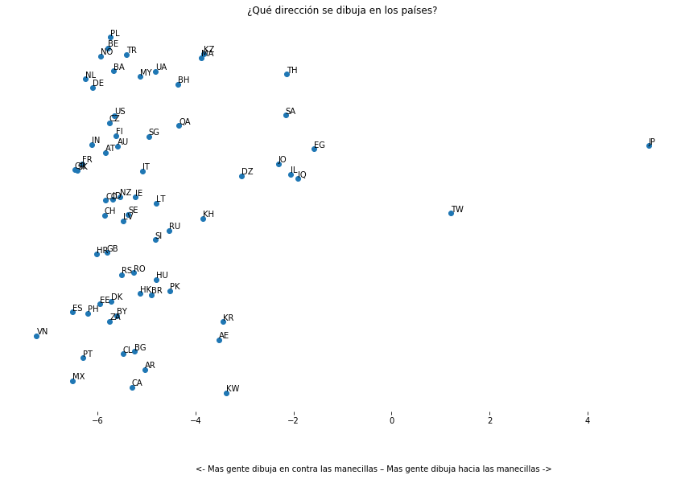

Círculos y Círculos
================
Alan 
2020 

Dibuja un círculo, ya sea con la mano o en la mente, pero dibuja uno. ¿Listo? 
¿Hacia qué lado empezaste? ¿Sentido de las manecillas del reloj o en contra? 

     

          
     

     

          
     

<!-- 

 -->

Si eres de América o Europa, lo mas probable es que fuera en contra las manecillas del reloj. Mientras en Japón lo mas seguro es que fuera en sentido de las manecillas. 
¿Como podemos saber esto? En noviembre del 2016, Google lanzo Quick, Draw!. Quick, Draw! Es un juego el cual te pide dibujar una palabra en un tiempo determinado y una Inteligencia Artificial trata de adivinar. Se puede jugar [aquí]( https://quickdraw.withgoogle.com/).
 

Google lanzó al público más de 50 millones de dibujos, hechos por distintas personas que han jugado Quick Draw. Gracias a este set de imágenes podemos conocer como la gente dibuja, y encontrar distintas relaciones. Un ejemplo de esto son las imágenes de círculos.
Gracias a<a href="https://www.element84.com/blog/determining-the-winding-of-a-polygon-given-as-a-set-of-ordered-points">Geometría</a> podemos saber que direccion se uso para dibujar el circulo.

En la siguiente grafica podemos ver la dirección de distintos países. Cuando es negativo el valor el circulo va en contra de las manecillas del reloj, cuando es positivo es lo contrario. 

Vemos que México es de los países mas negativos es decir la mayoría de la gente dibuja círculos hacia la izquierda.  Mientras tanto, tenemos 2 lugares que dibujan círculos hacia la derecha, estos son Taiwán y Japón. 

¿Porque es esto? 

<!-- 
Recently, there’s been a great deal of excitement and interest in deep neural networks because they’ve achieved breakthrough results in areas such as computer vision.<a href="#fn1" class="footnoteRef" id="fnref1">1</a>

However, there remain a number of concerns about them. One is that it can be quite challenging to understand <em>what</em> a neural network is really doing. If one trains it well, it achieves high quality results, but it is challenging to understand how it is doing so. If the network fails, it is hard to understand what went wrong.

While it is challenging to understand the behavior of deep neural networks in general, it turns out to be much easier to explore low-dimensional deep neural networks – networks that only have a few neurons in each layer. In fact, we can create visualizations to completely understand the behavior and training of such networks. This perspective will allow us to gain deeper intuition about the behavior of neural networks and observe a connection linking neural networks to an area of mathematics called topology.

A number of interesting things follow from this, including fundamental lower-bounds on the complexity of a neural network capable of classifying certain datasets.

<h2 id="a-simple-example">A Simple Example</h2>

Let’s begin with a very simple dataset, two curves on a plane. The network will learn to classify points as belonging to one or the other.

 -->