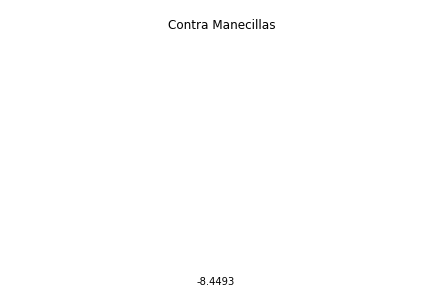
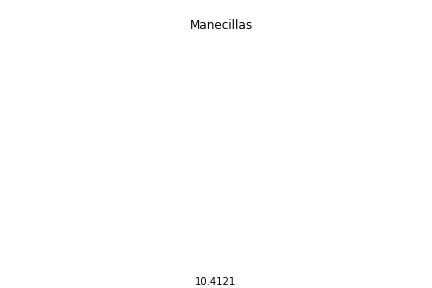

Círculos y Círculos
================
Alan 
2020 

Dibuja un círculo, ya sea con la mano o en la mente, pero dibuja uno. ¿Listo?  
¿Hacia qué lado empezaste? ¿Sentido de las manecillas del reloj o en contra? 

¿Sabías que donde vivas influye de que hacía que lado dibujas el circulo? En otras palabras, si eres de América o Europa, lo mas probable es que fuera en contra las manecillas del reloj. Mientras en Japón lo mas seguro es que fuera en sentido de las manecillas. 

¿Como podemos saber esto? En noviembre del 2016, Google lanzo Quick, Draw!. Quick, Draw! Es un juego el cual te pide dibujar una palabra en un tiempo determinado y una Inteligencia Artificial trata de adivinar. Se puede jugar <a href='https://quickdraw.withgoogle.com/'>aquí</a>.  
Para términos de investigación, Google lanzó al público más de 50 millones de dibujos, hechos por distintas personas que han jugado Quick Draw. Gracias a este set de imágenes podemos conocer como la gente dibuja, y encontrar distintas relaciones. Un ejemplo de esto son las imágenes de círculos.

Uno de los datos que Google guarda es el orden de los trazos que se usaron. Podríamos graficar cada uno de esos trazos para saber hacia qué lado se dibuja, sin embargo, debido a la cantidad de dibujos tomaría mucho tiempo. Otra forma es por <a href="https://www.element84.com/blog/determining-the-winding-of-a-polygon-given-as-a-set-of-ordered-points">Geometría</a>. El cual nos da una formula para saber qué dirección se uso al dibujar el circulo.

Al calcular la dirección del dibujo se genera un número. Si es negativo significa que se dibuja hacia la izquierda, y si es positivo se dibuja hacia la derecha. Para asegurarnos que es correcto, graficamos un circulo y añadimos el número. Y queda de esta manera:

     

          
     

     

          
     

¡Funciona! Ahora tenemos la dirección para cada dibujo.  
Otro dato que Google guarda es el país donde se realizó el dibujo. Asi que podemos juntar cada dirección de cada dibujo por país y promediarlo. La idea es que entre más dibujos tengan dirección negativa,  

Vemos que México es de los países mas negativos es decir la mayoría de la gente dibuja círculos hacia la izquierda.  Mientras tanto, tenemos 2 lugares que dibujan círculos hacia la derecha, estos son Taiwán y Japón.

Podemos ver individualmente los países.

<table class="center">
     <tr>
          <td><h3>México</h3></td>
          <td></td>
          <td></td>
     </tr>
     <tr>
          <td><h3>US</h3></td>
          <td></td>
          <td></td>
     </tr>
     <tr>
          <td><h3>Japon</h3></td>
          <td></td>
          <td></td>
     </tr>
</table>

