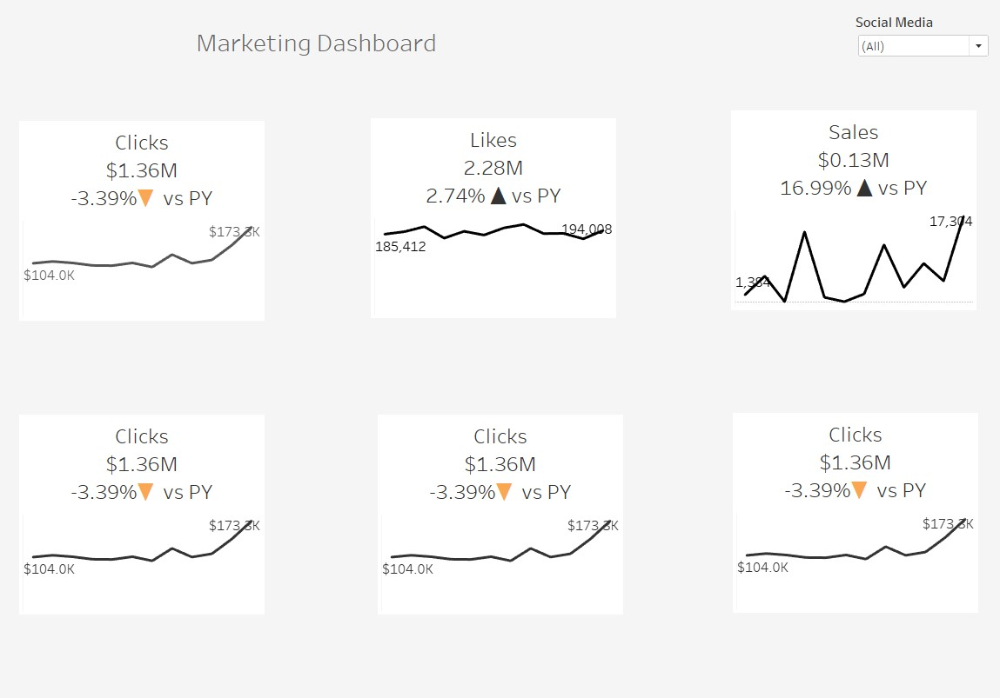

Simple Marketing Dashboard
================
Alan 
2021 

The following is a concept for a simple marketing dashboard. This dashboard was made in Tableau, still a work in progress.

The idea for this dashboard is to only use BANs.  
BANs mean Big Aggregated Numbers and are useful for summarizing data. They work as important KPIs figures.  
The dashboard can accommodate 3 rows and 3 columns of BANs. 
Each KPI consist of the following: 
 
•	Title 
•	Current year number 
•	% Change vs previous year, using arrows to denote trend.  
•	Monthly line for the current year, with labels at the beginning of the year and the end of the year.  
 
Other ideas: change in design, add a previous year with less contrast.  
I will be updating this page with those ideas. 

 

