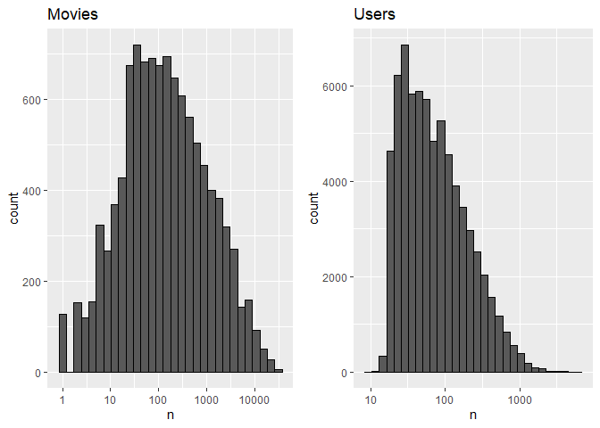
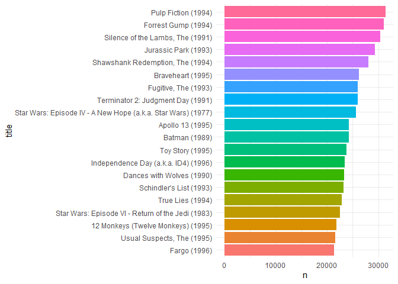
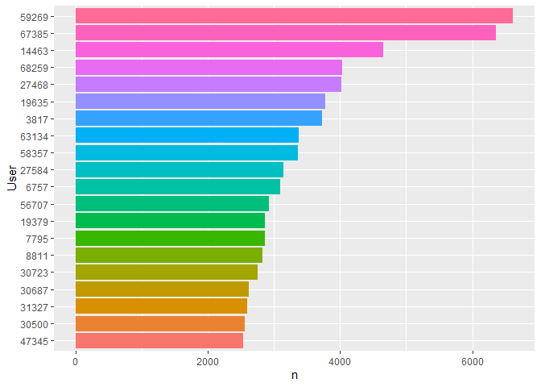
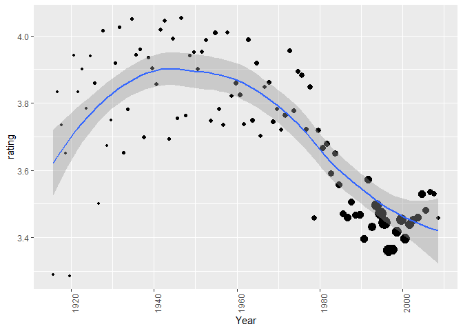
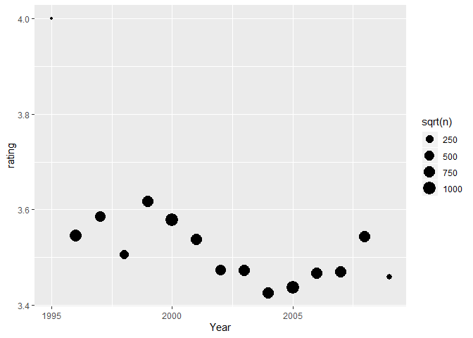
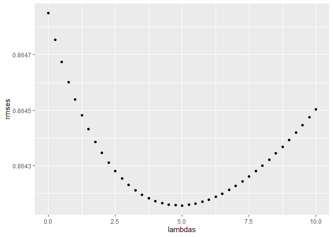
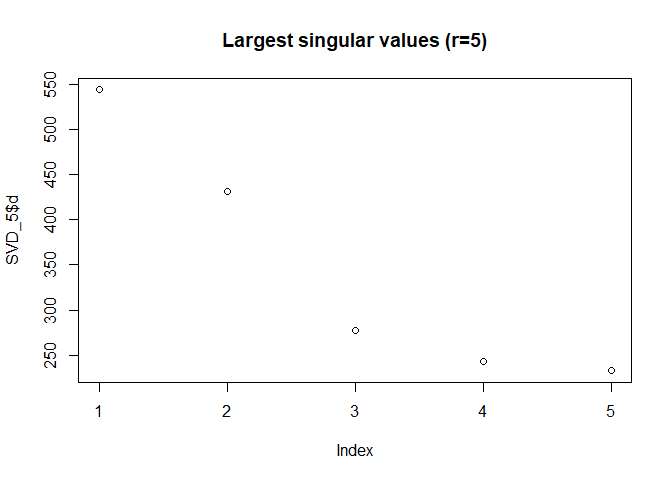
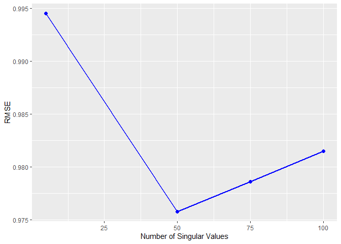

MovieLens
================
Alan
September 2, 2019

<div class="centerimgcontainer">

</div>

Summary
-------

The MovieLens data set contains the ratings that each user gave to watched movies. We used the 10M data set, divided into a training set called edx (made of 9,000,055 observations) and a validation set (999,999 observations) where we predicted the ratings. After exploration of the data the edx set was divided into a train set and a valid set in order to find the model and tune the parameters, leading to the following model: *Y*<sub>*u*, *i*</sub> = *μ* + *b*<sub>*i*</sub> + *b*<sub>*u*</sub> + *b*<sub>*y*, *i*</sub> + *b*<sub>*y*, *u*</sub> + *p*<sub>*u*</sub>*q*<sub>*i*</sub> + *ε*<sub>*u*, *i*</sub> where it takes the average of the ratings, adds the regularized per movie effect, per user effect, year of movie released effect, year the user rated effect and using Single Value Decomposition to find 50 latent features. This model help us achieve an RMSE of 0.8578388 on the validation set.

Data Exploration
----------------

Before going to the model we need to understand the data and see the relations of the variables. We see the structure of the data frame, the summary of the columns and how many unique users and movies are.

    ## 'data.frame':    9000055 obs. of  6 variables:
    ##  $ userId   : int  1 1 1 1 1 1 1 1 1 1 ...
    ##  $ movieId  : num  122 185 292 316 329 355 356 362 364 370 ...
    ##  $ rating   : num  5 5 5 5 5 5 5 5 5 5 ...
    ##  $ timestamp: int  838985046 838983525 838983421 838983392 838983392 838984474 838983653 838984885 838983707 838984596 ...
    ##  $ title    : chr  "Boomerang (1992)" "Net, The (1995)" "Outbreak (1995)" "Stargate (1994)" ...
    ##  $ genres   : chr  "Comedy|Romance" "Action|Crime|Thriller" "Action|Drama|Sci-Fi|Thriller" "Action|Adventure|Sci-Fi" ...

|     |     userId    |    movieId    |     rating    |     timestamp     |       title      |      genres      |
|-----|:-------------:|:-------------:|:-------------:|:-----------------:|:----------------:|:----------------:|
|     |    Min. : 1   |    Min. : 1   |  Min. :0.500  |  Min. :7.897e+08  |  Length:9000055  |  Length:9000055  |
|     | 1st Qu.:18124 |  1st Qu.: 648 | 1st Qu.:3.000 | 1st Qu.:9.468e+08 | Class :character | Class :character |
|     | Median :35738 | Median : 1834 | Median :4.000 | Median :1.035e+09 |  Mode :character |  Mode :character |
|     |  Mean :35870  |  Mean : 4122  |  Mean :3.512  |  Mean :1.033e+09  |        NA        |        NA        |
|     | 3rd Qu.:53607 | 3rd Qu.: 3626 | 3rd Qu.:4.000 | 3rd Qu.:1.127e+09 |        NA        |        NA        |
|     |  Max. :71567  |  Max. :65133  |  Max. :5.000  |  Max. :1.231e+09  |        NA        |        NA        |

|  n\_users|  n\_movies|
|---------:|----------:|
|     69878|      10677|

Our data is in 6 columns. The first 2 representing the user and movie id, then the variable that we need to predict, the time stamp is in value instead of a date format, and finally we have the title and genres. We also see that we have more unique users than movies about 6 times more. Looking at the variable to predict, the lowest rating is .5, but the 1st quarterly is 3 so it seems that the ratings are high. Looking at a graph of ratings we see that we were right.

<div class="bigcenterimgcontainer">

</div>
<div class="spaceafterimg"></div>

We took the sqrt of the counts to see the results better and we found the following. Whole ratings are more prevalent than half ratings. Most of the ratings fall on 3 or 4, giving the set an average of 3.512.

Plotting the distribution of movies and users to see how many users rated a movie and how often the users rate, we get the following plots:

``` r
p1 <- edx %>% count(movieId) %>% 
  ggplot(aes(n)) + geom_histogram(bins = 30, color = "black") + 
  scale_x_log10() + ggtitle("Movies")
p2 <- edx %>% count(userId) %>% 
  ggplot(aes(n)) + geom_histogram(bins = 30, color = "black") + 
  scale_x_log10() + ggtitle("Users")
grid.arrange(p1, p2, nrow = 1)
```
<div class="bigcenterimgcontainer">

</div>
<div class="spaceafterimg"></div>

We see movies with only 1 rating, but overall looks like a normal distribution with most movies having around 100 ratings. In the users we see that is right skewed, on average people rate low, with some users having rated 10 times.But there are other users that have rated more than 1000 times,

We plot the top 20 movies by number of ratings, and we find that there are big know movies like pulp fiction, Forrest gump, etc. The top 20 movies have over 20,000 ratings.

<div class="bigcenterimgcontainer">

</div>
<div class="spaceafterimg"></div>

Plotting the top 20 users, we see that the first two have over 5,000 rated movies and the number of ratings decreases more quickly in comparison to the movies.

<div class="bigcenterimgcontainer">

</div>

### Movie Years effect on rating

We see that the titles have the year released next to them. We are interested to see if there is an influence of year released to ratings. In order to do so we will create a title data frame and extract the year from the title using the following code:

``` r
titles <- edx %>% group_by(movieId, title) %>%
  select(movieId, title, genres, rating)
titles$Year <- str_extract(titles$title, "\\((\\d{4})\\)")
titles$Year <- str_remove(titles$Year,"\\(")
titles$Year <- str_remove(titles$Year,"\\)")
kable(titles[1:2,1:5])
```

|  movieId| title            | genres                |  rating| Year |
|--------:|:-----------------|:----------------------|-------:|:-----|
|      122| Boomerang (1992) | Comedy|Romance        |       5| 1992 |
|      185| Net, The (1995)  | Action|Crime|Thriller |       5| 1995 |

Then we plot the average rating against the year and we find the following graph.

    ## `geom_smooth()` using method = 'loess' and formula 'y ~ x'

<div class="bigcenterimgcontainer">

</div>

The size of the points represents the number of ratings. We see that recent movies have more ratings than older movies, however we see a trend. From 1980 the average rating starts to decrease.

### User year effect

Likewise we want to see if there is an effect from the date the user rated.

<div class="bigcenterimgcontainer">

</div>

We see that except for the 1995 year, the rest of the years it goes up or down around the 3.5 of the mean.

Choosing Parameters
-------------------

We are going to take those two effects and along the movie and users effects we are going to apply regularization. In order to find the optimal lambda and the number of features for SVD we are going to divide the edx set into a train and valid set.

``` r
kable(train_set[1:3,1:8])
```

|  userId|  movieId|  rating| timestamp           | title            | genres                       | ym   |  yeus|
|-------:|--------:|-------:|:--------------------|:-----------------|:-----------------------------|:-----|-----:|
|       1|      122|       5| 1996-08-02 11:24:06 | Boomerang (1992) | Comedy|Romance               | 1992 |  1996|
|       1|      185|       5| 1996-08-02 10:58:45 | Net, The (1995)  | Action|Crime|Thriller        | 1995 |  1996|
|       1|      292|       5| 1996-08-02 10:57:01 | Outbreak (1995)  | Action|Drama|Sci-Fi|Thriller | 1995 |  1996|

With ym representing the year of the movie and yeus representing the year the user rated. The train set has 7,200,083 of observations and the valid has 1,799,972 of observations.

### Regularization

There are users, years and movies with a small number of ratings that could bias the predicted rating, so we need to add a penalty to those small values using regularization. We need to find the lambda that minimizes the RMSE, first we take the values on the train set and use them to predict the values of the valid set, the one that minimizes the RMSE will be that lambda.

``` r
# Regularization, findind optimal lambda given:
lambdas <- seq(0, 10, 0.25)
rmses <- sapply(lambdas, function(l){
# movie mean
  mu <- mean(train_set$rating)
# movie effects  
  b_i <- train_set %>% 
    group_by(movieId) %>%
    summarize(b_i = sum(rating - mu)/(n()+l))
# user effects  
  b_u <- train_set %>% 
    left_join(b_i, by="movieId") %>%
    group_by(userId) %>%
    summarize(b_u = sum(rating - b_i - mu)/(n()+l))
# year of title effects
  b_y <- train_set %>%
    left_join(b_i, by = "movieId") %>%
    left_join(b_u, by = "userId") %>%
    group_by(ym) %>%
    summarize(b_y = sum(rating - b_i - b_u - mu)/(n()+l))
# year user effects  
  b_yu <- train_set %>%
    left_join(b_i, by = "movieId") %>%
    left_join(b_u, by = "userId") %>%
    left_join(b_y, by = "ym") %>%
    group_by(yeus) %>%
    summarize(b_yu = sum(rating - b_i - b_u - b_y - mu)/(n()+l))
  
  predicted_ratings <- 
    valid_set %>% 
    left_join(b_i, by = "movieId") %>%
    left_join(b_u, by = "userId") %>%
    left_join(b_y, by = "ym") %>%
    left_join(b_yu, by = "yeus") %>%
    mutate(pred = mu + b_i + b_u + b_y + b_yu) %>%
    pull(pred)
  
  return(RMSE(predicted_ratings, valid_set$rating))
})
qplot(lambdas, rmses)
```
<div class="bigcenterimgcontainer">

</div>


### SVD

We are going to optimize the number of latent features by minimizing the RMSE using the irlba library. By using matrix factorization in this case SVD we can find latent features (wherever a movie is a blockbuster or niche, or the user preferences). First we need to change our data frame to a matrix, rows for users and columns for movies. The resulting matrix will have points without values, that means the user has not rated that movie.

``` r
# changing from data frame to sparse matrix using matrix library
x <- train_set[ , c("userId","movieId","rating")]
x$rating <- x$rating - mu   #removing the mean as it will be added later in the final model
mat <- sparseMatrix(i = x$userId,j = x$movieId, x = x$rating)
```

The irlba library calculates a truncated svd where you can select the number of singular values as long as is lower than the number of columns or rows. It also calculates when you have sparse matrix. We are going to calculate different number and find the one with the lowest rmse.

``` r
#  Finding the optimal number of svd 
SVD_5=irlba(mat,nu=5,nv=5)
SVD_50=irlba(mat,nu=50,nv=50)
SVD_75=irlba(mat,nu=75,nv=75)
SVD_100=irlba(mat,nu=100,nv=100)
plot(SVD_5$d, main="Largest singular values (r=5)") #see latent factors
```
<div class="bigcenterimgcontainer">

</div>

We are going to take the decomposition and dot multiply to have the predicted ratings.

``` r
# You need to separate and predict only on the values that you need, if you 
# dot product on the entire matix you will get a memory error
u_sigma5 <- SVD_5$u %*% diag(SVD_5$d)
vt5 <- t(SVD_5$v)
u_sigma50 <- SVD_50$u %*% diag(SVD_50$d)
vt50 <- t(SVD_50$v)
u_sigma75 <- SVD_75$u %*% diag(SVD_75$d)
vt75 <- t(SVD_75$v)
u_sigma100 <- SVD_100$u %*% diag(SVD_100$d)
vt100 <- t(SVD_100$v)
```

We cannot dot multiply the entire matrix because of memory limitations, so for each value we want to predict we take the dot product just of those values, in the following way.

``` r
#testing on valid set
v <- valid_set[ ,c(1,2)]
id <- seq(1,length(valid_set[,1]),1)
# for 5 latent
calc <- function(i){
  user <- v[i,1]
  movie <- v[i,2]
  pred <- u_sigma5[user, ] %*% vt5[ ,movie]
} 
o5 <- lapply(id,calc)
df5 <- data.frame(matrix(unlist(o5), nrow=length(o5), byrow=T))
df5$rat <- df5$matrix.unlist.o5...nrow...length.o5...byrow...T. + mu
rm(o5,u_sigma5,vt5)
```

We calculate the RMSE and we have the following

``` r
#calculate rmse
rmse5 <- RMSE(valid_set$rating,df5$rat)
rmse50 <- RMSE(valid_set$rating,df50$rat)
rmse75 <- RMSE(valid_set$rating,df75$rat)
rmse100 <- RMSE(valid_set$rating,df100$rat)
rm(df5,df50,df100,df75)
kable(RMSEpreds <- data.frame('r'=c(5,50,75,100),'RMSE'=c(rmse5,rmse50,rmse75 ,rmse100)))
```

|    r|       RMSE|
|----:|----------:|
|    5|  0.9944936|
|   50|  0.9757889|
|   75|  0.9786236|
|  100|  0.9814660|

The number of SVD will be 50.

``` r
ggplot(RMSEpreds,aes(r,RMSE))+
  geom_line(col='blue',size=1) +
  geom_point(col='blue',size=2) +
  labs(x="Number of Singular Values", y="RMSE")
```
<div class="bigcenterimgcontainer">

</div>

Results
-------

Taking all and using it to predict the valid rating we have.

| Model          |       RMSE|
|:---------------|----------:|
| Average        |  1.0605061|
| Movie and User |  0.8645459|
| New            |  0.8542220|

We see that the results improve as we add more effects and latent features, however using this approach, looks that improving becomes difficult as with all the effects added we just improve 0.01. So other methods are needed in order to improve even more.

We use this approach to the whole set in order to predict the ratings in the validation set and we obtain the following result.

|          x|
|----------:|
|  0.8578388|

We see that it is a little bit worse, but still manages to be in the .85 part.

Conclusion
----------

SVD is the one that helps more in the improvements rather than the year effects. When doing this we found other alternatives like collaborative filtering using neural nets, so in the future we are going to explore that and see the improvement. Nevertheless this is a good model that manages to lower the RMSE and help us to learn even more, especially memory management and how to deal with large data sets.
