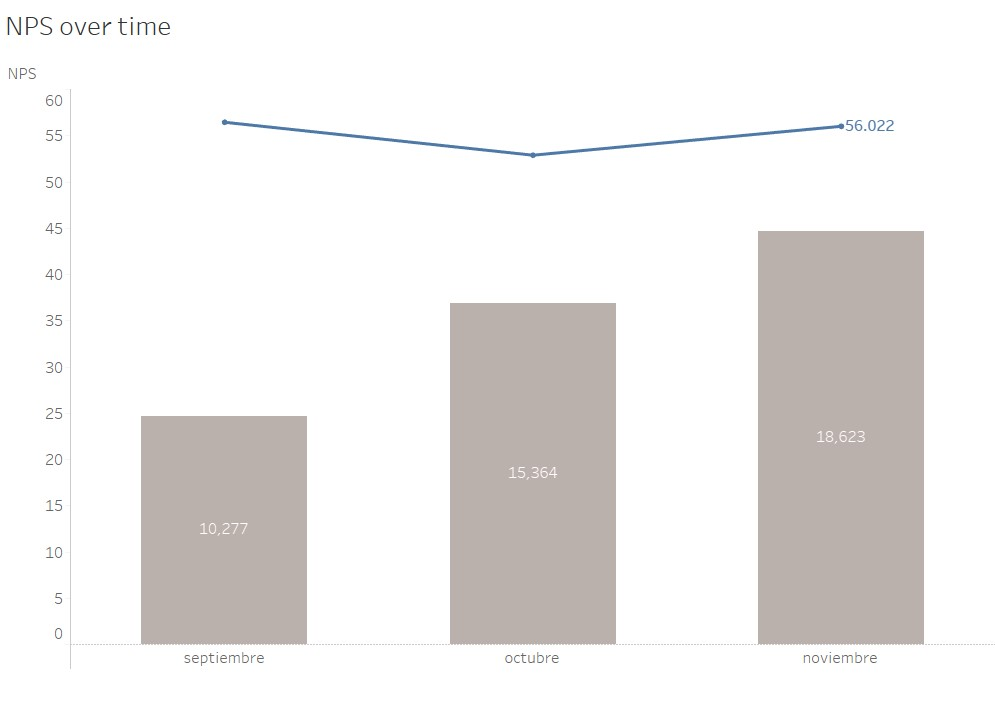
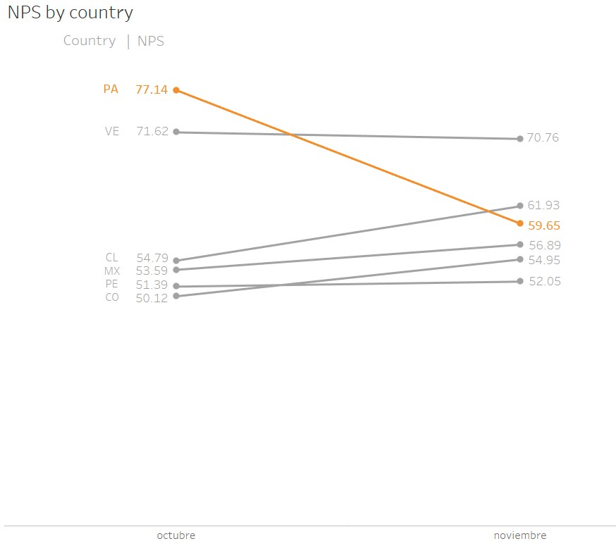
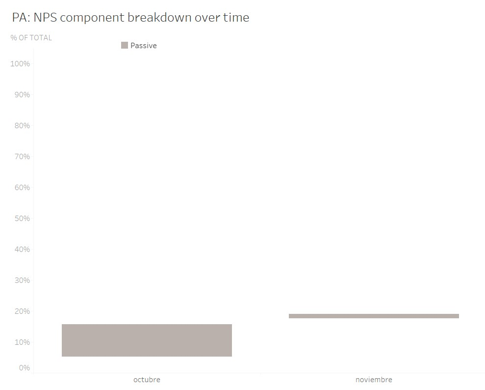
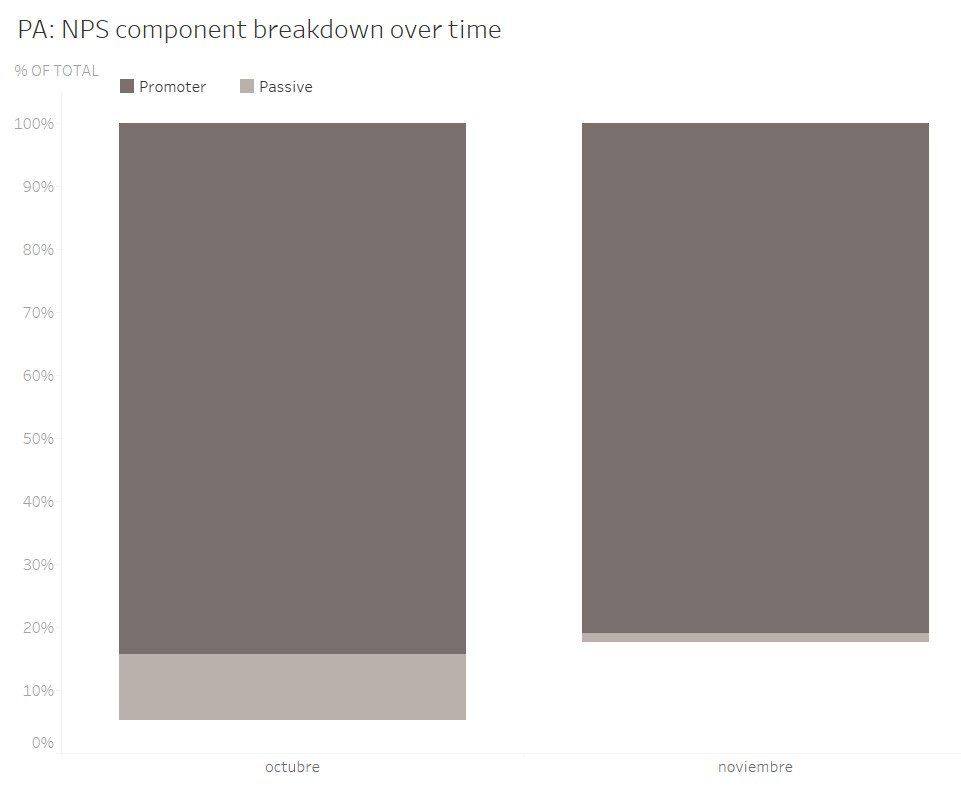
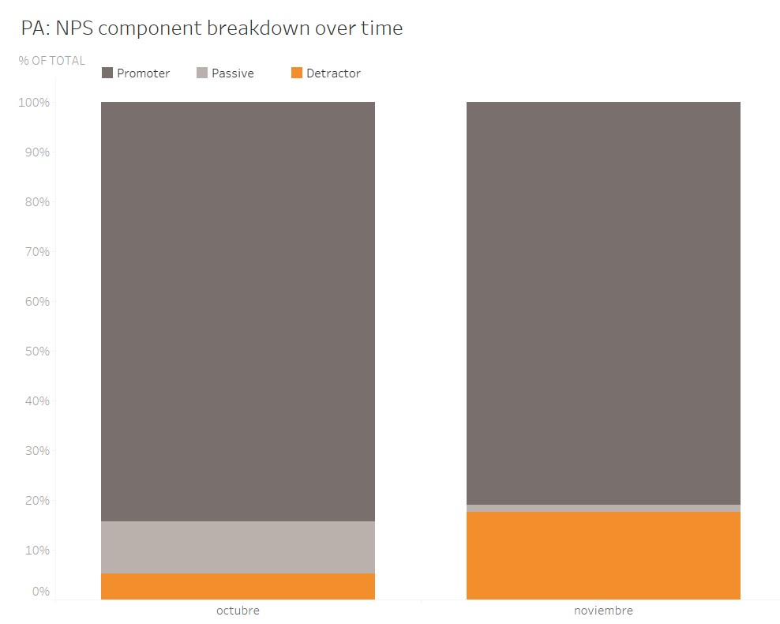

Monthly NPS
================
Alan 
2021 

The following is a brief analysis of a Monthly NPS presentation. The company and slides are omitted, and the values are modified for confidentiality. 
The first thing was to graph the NPS and the total number of responses over time. All the graphs were made in tableau for dashboard purposes and then send as image to a presentation.

<h4>Overall NPS</h4>

We see that the NPS is largely stable, in November we recovered from the problems in October. 
In total responses, we continue to increase the number of responses

<h4>NPS by country</h4>

Overall NPS shows an improvement, however that in not the complete story. If we see the changes in NPS by country, then we see a different story. 
We see 4 countries with improvements and 2 countries with decreases. The important one and the problem is PA. PA has a 22% decrease to the previous month, so we need to focus in that area.

