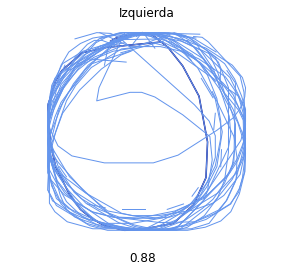

Back to school store survey
================
Alan 
2020 

Dibuja un círculo, ya sea con la mano o en la mente, pero dibuja uno. ¿Listo?  
No es una pregunta muy común, pero ¿Hacia qué lado empezaste? ¿Sentido de las manecillas del reloj o en contra? 

¿Sabías que donde vivas influye de que hacía que lado dibujas el circulo? En otras palabras, si eres de América o Europa, lo mas probable es que fuera en contra las manecillas del reloj. Mientras en Japón lo mas seguro es que fuera en sentido de las manecillas. 

¿Como podemos saber esto? En noviembre del 2016, Google lanzo Quick, Draw!. Quick, Draw! Es un juego el cual te pide dibujar una palabra en un tiempo determinado y una Inteligencia Artificial trata de adivinar. Se puede jugar <a href='https://quickdraw.withgoogle.com/'>aquí</a>.  
Para términos de investigación, Google lanzó al público más de 50 millones de dibujos, hechos por distintas personas que han jugado Quick Draw. Gracias a este set de imágenes podemos conocer como la gente dibuja, y encontrar distintas relaciones. Un ejemplo de esto son las imágenes de círculos.

Uno de los datos que Google guarda es el orden de los trazos que se usaron. Podríamos graficar cada uno de esos trazos para saber hacia qué lado se dibuja, sin embargo, debido a la cantidad de dibujos tomaría mucho tiempo. Otra forma es por <a href="https://www.element84.com/blog/determining-the-winding-of-a-polygon-given-as-a-set-of-ordered-points">Geometría</a>. El cual nos da una formula para saber qué dirección se uso al dibujar el circulo.

Al calcular la dirección del dibujo se genera un número. Si es negativo significa que se dibuja hacia la izquierda, y si es positivo se dibuja hacia la derecha. Para asegurarnos que es correcto, graficamos un circulo y añadimos el número. Y queda de esta manera:

     

          
     

     

          
     

¡Funciona! Ahora tenemos la dirección para cada dibujo.  
Otro dato que Google guarda es el país donde se realizó el dibujo. Asi que podemos juntar cada dirección de cada dibujo por país y promediarlo. La idea es que entre más dibujos tengan dirección negativa, el país en promedio va a ser negativo. Vamos a visualizarlo, en la siguiente gráfica tenemos todos los países y que tanto de dibuja hacia la derecha o izquierda.   

Con esto podemos darnos una idea de cómo la gente dibuja en distintos lados. Vemos que México es de los países más negativos, es decir la mayoría de la gente dibuja círculos hacia la izquierda.  Mientras tanto, tenemos 2 lugares que dibujan círculos hacia la derecha, estos son Taiwán y Japón. Esto no significa que todos dibujan círculos hacia la izquierda o a la derecha.

Si nos enfocamos individualmente, país por país, podemos encontrar que la gente dibuja de los dos lados en distinta proporción. En el caso de México, del número de dibujos que hay 88% dibuja hacia la izquierda mientras que el 12% dibuja hacia la derecha. 
Incluyendo México vamos a elegir 4 de los 68 países que graficamos previamente y separar por dirección los círculos. Elegimos México por ser de los países mas negativos en promedio, USA por estar entre la mayoría de los países, Egipto por ser de los países menos negativos y finalmente Japón por ser el país más positivo. Graficamos algunos de los círculos que la gente dibujó y la proporción de gente que dibuja círculos hacia la izquierda o derecha.

<table class="center">
     <tr>
          <td><h3>México</h3></td>
          <td></td>
          <td></td>
     </tr>
     <tr>
          <td><h3>USA</h3></td>
          <td></td>
          <td></td>
     </tr>
     <tr>
          <td><h3>Egipto</h3></td>
          <td></td>
          <td></td>
     </tr>
     <tr>
          <td><h3>Japón</h3></td>
          <td></td>
          <td></td>
     </tr>
</table>

Cool! No solo vemos la distribución de qué lado dibujan, sino que también vemos los dibujos que las personas hicieron. Lamentablemente no es posible graficar todos los dibujos y solo se muestra un pequeño set de estos, sin embargo, podemos ver cómo la gente dibuja círculos en distintos tamaños y posiciones. En este caso Egipto parece ser muy caótico para dibujar círculos. 

¿Existe alguna razón por la cual ciertos países dibujan círculos hacia la derecha, mientras el resto dibuja hacia la izquierda? 
La diferencia puede ser explicada debido a la escritura y lectura de países orientales. 
En términos de escritura, Japón usa 3 componentes de escritura: Hiragana, Katakana y Kanji. Cada componente tiene sus propias características y similitudes. Lo que nos importa es que estos componentes tienen pasos para escribirlos. Si aprendes este idioma, lo que descubres es que cada letra o kanji tiene una forma correcta de escribirse. Cuando encuentras formas redondas la manera correcta de escribirlas es haciendo el circulo o la forma hacia las manecillas del reloj.  
En términos de lectura, nosotros generalmente leemos de izquierda a derecha. En Japón se lee de arriba hacia abajo empezando de la derecha hacia la izquierda.  
Las siguientes imágenes muestran estos dos términos, la letra a y la forma correcta de escribirse, y una parte de un libro en japones con la dirección de lectura.

     

          
     

     

          
     

Es interesante descubrir que esto tiene relación en como las personas dibujan círculos en distintos países y como descubrimos esto gracias a las imágenes que se generaron de un juego. Existen muchas más imágenes y más cosas por descubrir con este set de datos. Gracias por tu tiempo y cualquier duda, comentario o sugerencia ¡contáctame!

 

